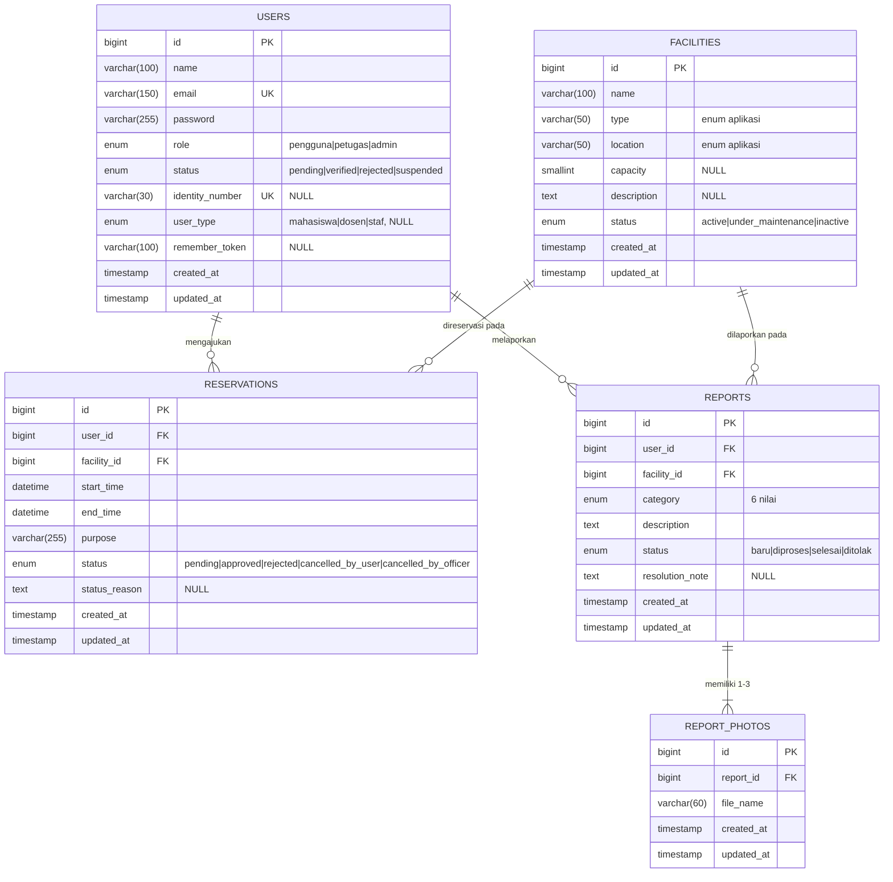

# Halaman, Navigasi & Skema Database
## Sistem Reservasi & Pelaporan Fasilitas Kampus

**Mata kuliah:** Pengembangan Platform Khusus (PPK)
**Versi dokumen:** 1.1 — 18 September 2026
**Dokumen induk:** `dasar-proyek.md`

Dokumen induk berisi **aturan bisnis yang mengikat**. Dokumen ini berisi **penerapannya** ke halaman dan tabel. Kalau ada yang terasa bertentangan, dokumen induk yang menang, dan perbedaannya harus dilaporkan ke tim supaya salah satunya diperbaiki.

Kode halaman (P1, U1, O1, A1, …) di dokumen ini bersifat final dan dipakai sebagai rujukan bersama.

---

## Perubahan dari v1.0

| Bagian | Perubahan |
|---|---|
| Header | Nama file dokumen tidak lagi memuat nomor versi; rujukan antar-dokumen jadi stabil |
| 2.1 | Notasi `?redirect=...` ditegaskan maksudnya. Ia menggambarkan perilaku, bukan query param yang ditulis sendiri |

---

# BAGIAN I — HALAMAN & NAVIGASI

## 1. Daftar halaman

**Total 22 halaman.** Mayoritas berupa pasangan daftar + detail yang strukturnya seragam.

### 1.1 Publik (tanpa login)

| Kode | Halaman | Tujuan | Hak akses | Masuk dari |
|---|---|---|---|---|
| **P1** | Beranda / Daftar Fasilitas | Menampilkan seluruh fasilitas beserta status, dengan filter tipe, lokasi, dan kapasitas | Semua | URL root, navbar, landing pengguna |
| **P2** | Detail Fasilitas + Grid Ketersediaan | Informasi fasilitas dan grid 26 slot per tanggal; hanya status terisi/kosong, tanpa identitas pemohon atau tujuan | Semua | Klik kartu di P1 |
| **P3** | Login | Autentikasi | Tamu | Navbar, redirect dari route terproteksi |
| **P4** | Registrasi Mandiri | Membuat akun berstatus `pending` | Tamu | Tautan di P3 |

P1 dan P2 **dipakai ulang oleh pengguna yang sudah login**; yang berubah hanya munculnya tombol "Ajukan Reservasi" dan "Laporkan Kerusakan". Datanya identik, jadi tidak perlu route terpisah. Pemisahan route yang diwajibkan F4 berlaku pada data yang mengandung `purpose` dan identitas pemohon, bukan pada daftar fasilitas.

### 1.2 Pengguna (login, role `pengguna`)

| Kode | Halaman | Tujuan | Hak akses | Masuk dari |
|---|---|---|---|---|
| **U1** | Form Ajukan Reservasi | Memilih fasilitas, tanggal, slot mulai dan selesai, serta tujuan penggunaan | `pengguna` | Tombol di P2 (fasilitas ter-prefill), navbar (dropdown kosong) |
| **U2** | Riwayat Reservasi Saya | Daftar seluruh reservasi milik sendiri beserta statusnya | `pengguna` | Navbar |
| **U3** | Detail Reservasi Saya | Detail lengkap satu reservasi, termasuk alasan penolakan atau pembatalan | `pengguna`, hanya miliknya | Klik baris di U2 |
| **U4** | Form Lapor Kerusakan | Kategori, deskripsi, dan unggah 1–3 foto | `pengguna` | Tombol di P2 (fasilitas ter-prefill), navbar |
| **U5** | Daftar Laporan Saya | Daftar laporan milik sendiri beserta statusnya | `pengguna` | Navbar |
| **U6** | Detail Laporan Saya | Detail laporan, foto, dan catatan resolusi petugas | `pengguna`, hanya miliknya | Klik baris di U5 |

U1 harus berfungsi dalam dua keadaan: `facility_id` sudah terisi (datang dari P2) atau belum (datang dari navbar). Ini satu kondisi di Blade, bukan dua halaman.

Kepemilikan pada U3 dan U6 diperiksa lewat **Laravel Policy**, bukan lewat `if` di controller (F4).

### 1.3 Petugas

| Kode | Halaman | Tujuan | Hak akses | Masuk dari |
|---|---|---|---|---|
| **O1** | Dashboard Antrian | Dua panel berdampingan: reservasi menunggu dan laporan belum selesai, beserta jumlahnya | `petugas` | Landing setelah login, navbar |
| **O2** | Antrian Reservasi | Daftar reservasi dengan tab **Menunggu** / **Terlewat** / **Semua**, filter fasilitas dan tanggal | `petugas` | O1, navbar |
| **O3** | Detail Reservasi (Petugas) | Detail lengkap + aksi setujui, tolak, dan batalkan | `petugas` | Klik baris di O2 |
| **O4** | Daftar Laporan | Daftar laporan dengan filter status, kategori, dan fasilitas | `petugas` | O1, navbar |
| **O5** | Detail Laporan (Petugas) | Foto, ubah status, isi catatan resolusi, dan aksi tandai fasilitas dalam perbaikan | `petugas` | Klik baris di O4 |
| **O6** | Kelola Ketersediaan Fasilitas | Daftar fasilitas dengan aksi ubah status `active` ↔ `under_maintenance` | `petugas` | Navbar |

Tab "Terlewat" di O2 adalah penerapan A8. Halamannya sama, hanya query dan tombolnya berbeda, dan **status non-aktif tombolnya juga divalidasi di server**, bukan cuma di-*disable* di tampilan.

O6 ada di samping O5 karena US 12 punya dua arah. Menandai fasilitas dalam perbaikan wajar dilakukan dari laporan yang sedang ditangani (O5), tapi mengembalikannya ke `active` setelah selesai diperbaiki sering terjadi ketika laporannya sudah ditutup, sehingga butuh daftar fasilitas sendiri.

### 1.4 Admin

| Kode | Halaman | Tujuan | Hak akses | Masuk dari |
|---|---|---|---|---|
| **A1** | Daftar Fasilitas (Admin) | Seluruh fasilitas beserta status, dengan aksi tambah, edit, dan nonaktifkan | `admin` | Navbar |
| **A2** | Form Fasilitas | Satu form untuk mode tambah dan edit | `admin` | Tombol di A1 |
| **A3** | Daftar Akun | Seluruh akun dengan filter role dan status, serta penanda jumlah akun `pending` | `admin` | Landing setelah login, navbar |
| **A4** | Form Tambah Akun | Membuat akun petugas atau pengguna secara langsung; `identity_number` dan `user_type` muncul hanya untuk role `pengguna` | `admin` | Tombol di A3 |
| **A5** | Detail Akun | Verifikasi, tolak, suspend, aktifkan kembali, dan reset password | `admin` | Klik baris di A3 |
| **A6** | Rekap & Export | Form rentang tanggal, tab **Okupansi** dan **Frekuensi Kerusakan**, tombol export CSV | `admin` | Navbar |

A4 menggabungkan US 13 dan US 14 dalam satu halaman karena perbedaannya hanya dua field tambahan. Field bersyarat itu **wajib divalidasi di server** dengan `required_if:role,pengguna`, bukan sekadar disembunyikan JavaScript.

A5 adalah halaman paling padat aksi di sisi admin. Matriks transisi status akun ada di C2 dokumen induk dan **harus dibaca sebelum halaman ini dikoding**.

### 1.5 Landing page per role

| Role | Landing | Alasan |
|---|---|---|
| Pengguna | **P1** | Titik awal alur reservasi, dan tombol menuju U1 di P2 sudah membawa konteks fasilitas |
| Petugas | **O1** | Diminta langsung oleh US 8 |
| Admin | **A3** | Akun `pending` memblokir orang lain untuk login, jadi inilah pekerjaan admin yang paling mendesak. A6 tidak dipilih karena rekap bersifat periodik dan halamannya kosong sebelum rentang tanggal diisi |

Aturan umumnya ada di H1 dokumen induk: landing adalah halaman keadaan, bukan halaman aksi.

---

## 2. Peta navigasi

### 2.1 Jalur publik

```
P1 ──klik kartu fasilitas──────────> P2
P1 ──navbar────────────────────────> P3
P3 ──tautan "Belum punya akun"─────> P4
P4 ──submit berhasil───────────────> P3 + pesan "akun menunggu verifikasi admin"
P2 ──tombol aksi, belum login──────> P3, lalu kembali ke tujuan semula
P3 ──login berhasil────────────────> P1 | O1 | A3  (sesuai role)
P3 ──login gagal, status akun──────> tetap di P3 + pesan spesifik per status (C2)
```

Pesan kegagalan login **harus membedakan** masalah kredensial dan masalah status akun. Akun `pending`, `rejected`, dan `suspended` mendapat pesan masing-masing, bukan "email atau password salah".

**Baris kelima dan keenam berlaku bersamaan, bukan bertentangan.** v1.0 menulis baris kelima sebagai `P3 (?redirect=...)`, yang sempat terbaca seolah ada query param yang harus ditulis sendiri. Yang dimaksud adalah mekanisme `intended` bawaan Laravel: middleware `auth` menyimpan URL tujuan ke session, dan setelah login berhasil orangnya dikembalikan ke sana. Kalau tidak ada tujuan tersimpan — misalnya ia membuka P3 langsung dari navbar — barulah baris keenam berlaku dan ia mendarat di landing sesuai role.

Query param buatan sendiri **tidak dipakai**, karena tujuannya harus divalidasi manual supaya tidak bisa diarahkan ke situs lain.

### 2.2 Jalur pengguna

```
P2 ──"Ajukan Reservasi"────────────> U1 (facility_id ter-prefill)
P2 ──"Laporkan Kerusakan"──────────> U4 (facility_id ter-prefill)
U1 ──submit berhasil───────────────> U3 (reservasi baru, status pending)
U1 ──gagal validasi server─────────> kembali ke U1, input terisi + pesan spesifik
U2 ──klik baris────────────────────> U3
U3 ──"Batalkan"────────────────────> modal konfirmasi ──> U3 (cancelled_by_user)
U4 ──submit berhasil───────────────> U6 (laporan baru, status baru)
U5 ──klik baris────────────────────> U6
```

**Konfirmasi dan peringatan:**

| Pemicu | Perlakuan |
|---|---|
| Tombol "Batalkan" di U3 | Muncul bersyarat. Status `pending` selalu boleh; status `approved` hanya selama `CURDATE() < DATE(start_time)` (A1). Kalau sudah lewat, tombol diganti teks *"Sudah lewat batas pembatalan mandiri, hubungi petugas"* |
| Modal batalkan | Alasan opsional bagi pengguna (A7) |
| Kegagalan validasi di U1 | Pesan harus menyebut aturan yang dilanggar, bukan "data tidak valid" |

Daftar penolakan yang mungkin muncul di U1 dan wajib punya pesan sendiri: di luar jam operasional, bukan kelipatan 30 menit, melintasi tanggal, `end_time` tidak lebih besar dari `start_time`, tanggalnya kurang dari H-1, lebih dari 30 hari ke depan, dan fasilitas tidak berstatus `active`.

### 2.3 Jalur petugas

```
O1 ──panel reservasi───────────────> O2 ──klik baris──> O3
O1 ──panel laporan─────────────────> O4 ──klik baris──> O5
O3 ──"Setujui"─────────────────────> modal konfirmasi ──> O2 (berhasil)
                                                       └─> O3 + pesan bentrok (F2)
O3 ──"Tolak"───────────────────────> modal + alasan WAJIB min 10 karakter ──> O2
O3 ──"Batalkan" (approved)─────────> modal + alasan WAJIB min 10 karakter ──> O2
O5 ──ubah status ke selesai/ditolak> catatan resolusi WAJIB (B3) ──> O4
O5 ──"Tandai Dalam Perbaikan"──────> peringatan D4 ──> O5
O6 ──ubah status fasilitas─────────> peringatan D4 ──> O6
```

**Konfirmasi dan peringatan:**

| Pemicu | Perlakuan |
|---|---|
| **Peringatan D4** | Modal berisi **daftar reservasi `approved` yang belum lewat** pada fasilitas tersebut, masing-masing dengan tautan ke O3. Bukan `confirm()` browser, karena isinya data. Tidak ada pembatalan otomatis |
| **Bentrok saat approve** | Pesan harus menyebut reservasi mana yang bentrok, bukan sekadar "gagal". Kondisi ini muncul ketika petugas lain baru saja menyetujui reservasi yang bertumpuk (F2) |
| **Tab Terlewat di O2** | Read-only. Server menolak approve dan reject untuk reservasi `pending` yang `start_time`-nya sudah lewat |
| **Catatan resolusi di O5** | Kewajibannya berubah mengikuti status yang dipilih di dropdown. Aturan lengkap di B3 |

Peringatan D4 muncul di tiga tempat pada jalur petugas dan admin (O5, O6, A1) ditambah pola yang sama untuk suspend akun di A5. **Keempatnya memakai logika yang identik**, jadi dibuat sebagai satu Blade component + satu method di model. Sepakati di awal siapa yang menulisnya, karena dipakai lintas modul.

### 2.4 Jalur admin

```
A1 ──"Tambah"──────────────────────> A2 ──submit──> A1
A1 ──"Edit"────────────────────────> A2 (mode edit) ──submit──> A1
A1 ──"Nonaktifkan"─────────────────> modal + peringatan D4 ──> A1
A3 ──"Tambah Akun"─────────────────> A4 ──submit──> A3
A3 ──klik baris────────────────────> A5
A5 ──"Verifikasi" | "Tolak"────────> A3
A5 ──"Suspend"─────────────────────> peringatan daftar reservasi terdampak (C6) ──> A5
A5 ──"Reset Password"──────────────> modal input password baru ──> A5
A6 ──submit rentang tanggal────────> A6 (dengan hasil) ──"Export CSV"──> unduh berkas
```

Tombol aksi di A5 muncul sesuai matriks transisi C2. Akun berstatus `verified` tidak menampilkan tombol "Verifikasi", dan tidak ada satu pun tombol yang mengembalikan akun ke `pending`.

---

## 3. Pemetaan user story ↔ halaman

### 3.1 Dari user story ke halaman

| US | Isi ringkas | Halaman |
|---|---|---|
| 1 | Lihat daftar fasilitas + ketersediaan per slot, tanpa detail | P1, P2 |
| 2 | Cari fasilitas berdasarkan tipe/lokasi/kapasitas | P1 |
| 3 | Ajukan reservasi dengan tujuan penggunaan | U1 |
| 4 | Batalkan reservasi sendiri sebelum batas waktu | U3 |
| 5 | Lihat riwayat, status, dan detail reservasi sendiri | U2, U3 |
| 6 | Laporkan kerusakan (kategori, deskripsi, foto) | U4 |
| 7 | Lihat status laporan sendiri | U5, U6 |
| 8 | Dashboard antrian reservasi & laporan yang menunggu | O1, O2, O4 |
| 9 | Setujui/tolak reservasi, sistem cegah bentrok | O3 |
| 10 | Batalkan reservasi approved dengan alasan | O3 |
| 11 | Ubah status laporan + catatan resolusi | O5 |
| 12 | Tandai fasilitas dalam perbaikan dan kembalikan ke aktif | O5, O6 |
| 13 | Daftarkan akun petugas | A4 |
| 14 | Daftarkan akun pengguna | A4 |
| 15 | Verifikasi/tolak akun hasil registrasi mandiri | A3, A5 |
| 16 | Kelola data fasilitas (tambah/edit/nonaktifkan) | A1, A2 |
| 17 | Lihat dan ekspor rekap okupansi & frekuensi kerusakan | A6 |

Ketujuh belas user story terpetakan. Tidak ada yang tanpa halaman.

### 3.2 Dari halaman ke user story

| Halaman | US | Halaman | US |
|---|---|---|---|
| P1 | 1, 2 | O2 | 8, 9 |
| P2 | 1 | O3 | 9, 10 |
| P3 | — (Aturan Implementasi: login) | O4 | 8, 11 |
| P4 | — (Aturan Implementasi: registrasi) | O5 | 11, 12 |
| U1 | 3 | O6 | 12 |
| U2 | 5 | A1 | 16 |
| U3 | 4, 5 | A2 | 16 |
| U4 | 6 | A3 | 15 |
| U5 | 7 | A4 | 13, 14 |
| U6 | 7 | A5 | 15 |
| O1 | 8 | A6 | 17 |

P3 dan P4 tidak dituntut user story manapun, tapi dituntut **Aturan Implementasi poin 1** pada dokumen tugas yang mewajibkan registrasi, login, dan logout. Itu dasar yang setara.

Satu-satunya elemen yang tidak punya dasar dari keduanya adalah **aksi Reset Password di A5**, yang merupakan konsekuensi keputusan C5. Ini disebut eksplisit di dokumen Word supaya tidak terlihat sebagai fitur yang muncul tanpa alasan.

---

## 4. Layar yang perlu dirancang lebih dulu

Lima halaman ini bentuknya perlu dipikirkan sebelum dikoding. Sisanya mengikuti pola daftar + detail yang seragam.

| Halaman | Kenapa rumit |
|---|---|
| **P2** Detail Fasilitas + Grid | 26 slot × banyak tanggal, tiga tingkat visibilitas data (F4), tiga status visual slot (D5), dan banner fasilitas dalam perbaikan |
| **U1** Form Ajukan Reservasi | Validasi client harus mencerminkan lima aturan server F1 tanpa menjadi sumber kebenaran kedua. Perlu diputuskan: dua dropdown slot atau pemilihan langsung di grid |
| **O1** Dashboard Antrian | Menyatukan dua alur yang bentuk datanya berbeda, dan harus menjawab tuntutan US 8 "agar tidak ada yang terlewat" |
| **O5** Detail Laporan (Petugas) | Kewajiban catatan resolusi berubah mengikuti status (B3), ditambah aksi US 12 yang memicu peringatan D4 |
| **A6** Rekap & Export | Satu filter tanggal melayani dua tabel dengan definisi berbeda (E2, E3), ditambah satu metrik tunggal (E5), dan export yang wajib memakai filter yang sama persis |

---

# BAGIAN II — SKEMA DATABASE

## 5. Ketentuan umum

- Storage engine **InnoDB**. Bukan preferensi: F2 memakai transaksi dan `lockForUpdate()` yang tidak berfungsi di MyISAM
- Charset `utf8mb4`, collation `utf8mb4_unicode_ci`
- Primary key `BIGINT UNSIGNED AUTO_INCREMENT` di semua tabel (`$table->id()`)
- Seluruh foreign key `NOT NULL`
- `created_at` dan `updated_at` bawaan Laravel di semua tabel (`$table->timestamps()`)
- Kolom waktu bisnis bertipe **`DATETIME`**, bukan `TIMESTAMP` (F3)

**Urutan migration wajib** — kalau timestamp nama file tidak urut, `php artisan migrate` gagal di komputer penguji:

```
1. users
2. facilities
3. reservations
4. reports
5. report_photos
```

---

## 6. Spesifikasi tabel

### 6.1 `users`

| Kolom | Tipe | Null | Default | Keterangan |
|---|---|---|---|---|
| `id` | BIGINT UNSIGNED AI | NO | — | PK |
| `name` | VARCHAR(100) | NO | — | |
| `email` | VARCHAR(150) | NO | — | **UNIQUE** |
| `password` | VARCHAR(255) | NO | — | bcrypt, minimal 8 karakter (C5) |
| `role` | ENUM | NO | `pengguna` | `pengguna` `petugas` `admin` — tidak dapat diubah setelah dibuat (C2) |
| `status` | ENUM | NO | `pending` | `pending` `verified` `rejected` `suspended` |
| `identity_number` | VARCHAR(30) | **YES** | NULL | NIM/NIP. **UNIQUE** (C4) |
| `user_type` | ENUM | **YES** | NULL | `mahasiswa` `dosen` `staf` |
| `remember_token` | VARCHAR(100) | YES | NULL | bawaan Laravel |
| `created_at`, `updated_at` | TIMESTAMP | YES | NULL | |

**Catatan penerapan:**

- `identity_number` dan `user_type` nullable **karena role**, bukan karena opsional. Petugas dan admin tidak punya keduanya. Dijaga di server dengan `required_if:role,pengguna` — batasan ini tidak bisa diwakili tipe kolom
- UNIQUE pada kolom nullable: MySQL membolehkan banyak baris NULL, jadi banyak petugas tanpa NIM tetap sah
- **Hapus `email_verified_at`** dari migration bawaan Laravel. Verifikasi email tidak dipakai, dan kolom yang tidak pernah diisi hanya mengundang pertanyaan
- Akun yang dibuat admin langsung berstatus `verified` (C2)

```php
$table->id();
$table->string('name', 100);
$table->string('email', 150)->unique();
$table->string('password');
$table->enum('role', ['pengguna', 'petugas', 'admin'])->default('pengguna');
$table->enum('status', ['pending', 'verified', 'rejected', 'suspended'])->default('pending');
$table->string('identity_number', 30)->nullable()->unique();
$table->enum('user_type', ['mahasiswa', 'dosen', 'staf'])->nullable();
$table->rememberToken();
$table->timestamps();
```

### 6.2 `facilities`

| Kolom | Tipe | Null | Default | Keterangan |
|---|---|---|---|---|
| `id` | BIGINT UNSIGNED AI | NO | — | PK |
| `name` | VARCHAR(100) | NO | — | |
| `type` | VARCHAR(50) | NO | — | Enum tingkat aplikasi (D1, F6) |
| `location` | VARCHAR(50) | NO | — | Enum tingkat aplikasi (D2, F6) |
| `capacity` | SMALLINT UNSIGNED | **YES** | NULL | Informatif (A4) |
| `description` | TEXT | YES | NULL | |
| `status` | ENUM | NO | `active` | `active` `under_maintenance` `inactive` |
| `created_at`, `updated_at` | TIMESTAMP | YES | NULL | |

**Catatan penerapan:**

- `type` dan `location` sengaja VARCHAR, bukan ENUM MySQL, karena daftarnya diharapkan bertambah. Nilai sah didefinisikan sebagai konstanta PHP dan divalidasi dengan `Rule::in()`. Alasan lengkap di F6
- `capacity` nullable dan tidak ditampilkan untuk tipe Alat. Filter kapasitas mengabaikan baris NULL (A4)
- Tidak ada penghapusan permanen (D6)

```php
$table->id();
$table->string('name', 100);
$table->string('type', 50);
$table->string('location', 50);
$table->unsignedSmallInteger('capacity')->nullable();
$table->text('description')->nullable();
$table->enum('status', ['active', 'under_maintenance', 'inactive'])->default('active');
$table->timestamps();

$table->index(['type', 'location'], 'idx_search');
$table->index('status', 'idx_status');
```

### 6.3 `reservations`

| Kolom | Tipe | Null | Default | Keterangan |
|---|---|---|---|---|
| `id` | BIGINT UNSIGNED AI | NO | — | PK |
| `user_id` | BIGINT UNSIGNED | NO | — | FK → `users.id` |
| `facility_id` | BIGINT UNSIGNED | NO | — | FK → `facilities.id` |
| `start_time` | **DATETIME** | NO | — | F1, F3 |
| `end_time` | **DATETIME** | NO | — | F1, F3 |
| `purpose` | VARCHAR(255) | NO | — | Tujuan penggunaan (US 3), minimal 5 karakter |
| `status` | ENUM | NO | `pending` | `pending` `approved` `rejected` `cancelled_by_user` `cancelled_by_officer` |
| `status_reason` | TEXT | YES | NULL | Aturan pengisian di A7 |
| `created_at`, `updated_at` | TIMESTAMP | YES | NULL | |

**Catatan penerapan:**

- **`DATETIME`, bukan `TIMESTAMP`.** Ini titik kegagalan yang paling mahal di proyek ini: `$table->timestamp('start_time')` akan menggeser seluruh jam reservasi di komputer dengan timezone MySQL berbeda, dan gejalanya sangat sulit dilacak. Periksa ini saat migration di-review
- `status_reason` wajib minimal 10 karakter untuk `rejected` dan `cancelled_by_officer`, opsional untuk `cancelled_by_user`, dan **harus NULL** untuk `pending` dan `approved`
- Tidak ada nilai `completed` maupun `expired`; keduanya diturunkan dari perbandingan waktu (A7, A8)
- Tidak ada kolom `jumlah_peserta` (A4) dan tidak ada kolom pencatat petugas pemroses (Bagian G)

```php
$table->id();
$table->foreignId('user_id')->constrained()->restrictOnDelete()->cascadeOnUpdate();
$table->foreignId('facility_id')->constrained()->restrictOnDelete()->cascadeOnUpdate();
$table->dateTime('start_time');
$table->dateTime('end_time');
$table->string('purpose', 255);
$table->enum('status', [
    'pending', 'approved', 'rejected',
    'cancelled_by_user', 'cancelled_by_officer',
])->default('pending');
$table->text('status_reason')->nullable();
$table->timestamps();

$table->index(['facility_id', 'status', 'start_time', 'end_time'], 'idx_conflict');
$table->index(['user_id', 'status', 'start_time'], 'idx_user_history');
$table->index(['status', 'start_time'], 'idx_queue');
```

### 6.4 `reports`

| Kolom | Tipe | Null | Default | Keterangan |
|---|---|---|---|---|
| `id` | BIGINT UNSIGNED AI | NO | — | PK |
| `user_id` | BIGINT UNSIGNED | NO | — | FK → `users.id`, pelapor |
| `facility_id` | BIGINT UNSIGNED | NO | — | FK → `facilities.id` |
| `category` | ENUM | NO | — | 6 nilai slug (B1) |
| `description` | TEXT | NO | — | |
| `status` | ENUM | NO | `baru` | `baru` `diproses` `selesai` `ditolak` |
| `resolution_note` | TEXT | YES | NULL | Wajib saat `selesai` dan `ditolak` (B3) |
| `created_at`, `updated_at` | TIMESTAMP | YES | NULL | |

**Catatan penerapan:**

- Nilai `category` disimpan sebagai slug, label tampilannya dari konstanta PHP (B1)
- Tidak ada foreign key ke `reservations` — penerapan B4
- Tidak ada kolom foto; foto berada di tabel terpisah (B2)

```php
$table->id();
$table->foreignId('user_id')->constrained()->restrictOnDelete()->cascadeOnUpdate();
$table->foreignId('facility_id')->constrained()->restrictOnDelete()->cascadeOnUpdate();
$table->enum('category', [
    'kerusakan_alat', 'kelistrikan', 'pendingin_ruangan',
    'furnitur', 'kebersihan', 'lainnya',
]);
$table->text('description');
$table->enum('status', ['baru', 'diproses', 'selesai', 'ditolak'])->default('baru');
$table->text('resolution_note')->nullable();
$table->timestamps();

$table->index(['status', 'created_at'], 'idx_queue');
$table->index(['facility_id', 'status'], 'idx_facility_freq');
$table->index(['user_id', 'status'], 'idx_reporter');
```

### 6.5 `report_photos`

| Kolom | Tipe | Null | Default | Keterangan |
|---|---|---|---|---|
| `id` | BIGINT UNSIGNED AI | NO | — | PK |
| `report_id` | BIGINT UNSIGNED | NO | — | FK → `reports.id`, CASCADE |
| `file_name` | VARCHAR(60) | NO | — | `Str::random(40)` + ekstensi (F5) |
| `created_at`, `updated_at` | TIMESTAMP | YES | NULL | |

**Catatan penerapan:**

- **Hanya nama file, tanpa path.** Foldernya konstanta di kode (`public/uploads/reports/`). Kalau path ikut disimpan per baris dan foldernya berpindah, semua baris harus di-update
- Nama file digenerate, bukan nama asli dari pengguna (F5)
- Batas 1–3 foto per laporan **tidak dijaga database**, melainkan validasi form

```php
$table->id();
$table->foreignId('report_id')->constrained()->cascadeOnDelete()->cascadeOnUpdate();
$table->string('file_name', 60);
$table->timestamps();
```

---

## 7. Relasi antar tabel

### 7.1 Istilah yang dipakai

Empat properti berbeda melekat pada satu hubungan antar tabel, dan sering tertukar:

| Istilah | Arti |
|---|---|
| **Derajat** (degree) | Jumlah entitas yang terlibat. Seluruh relasi di sistem ini **binary** — tidak ada unary/self-referencing maupun ternary |
| **Kardinalitas** (cardinality) | Batas **maksimum** berapa baris di satu sisi berpasangan dengan satu baris di sisi lain. Inilah yang menghasilkan istilah 1:1, 1:N, M:N |
| **Modalitas / partisipasi** (participation) | Batas **minimum**-nya: wajib (mandatory, minimal 1) atau opsional (optional, minimal 0) |
| **Identifying / non-identifying** | Apakah foreign key ikut menjadi bagian primary key entitas anak. Kalau ya, anaknya disebut *weak entity* |

Notasi **(min, max)** yang dipakai di bawah membaca kardinalitas dan modalitas sekaligus. `(1,1)` berarti wajib dan tepat satu; `(0,N)` berarti boleh nol dan boleh banyak.

### 7.2 Gambaran umum

```
USERS ──────┬─────< RESERVATIONS >─────┬────── FACILITIES
            │                          │
            └─────< REPORTS      >─────┘
                        │
                        └───< REPORT_PHOTOS
```

**Lima relasi, seluruhnya one-to-many dan binary.** Tidak ada satu pun relasi 1:1, M:N, maupun self-referencing.

`USERS` dan `FACILITIES` adalah dua induk yang tidak saling berhubungan. `RESERVATIONS` dan `REPORTS` masing-masing anak dari keduanya. `REPORT_PHOTOS` anak dari `REPORTS`, satu-satunya tabel di level ketiga.

**Tidak ada relasi many-to-many sama sekali, sehingga tidak ada tabel pivot.** Ini konsekuensi dua keputusan: C3 menetapkan satu akun satu role (kalau multi-role, butuh pivot `role_user`), dan F1 menolak tabel slot (kalau ada, butuh pivot antara reservasi dan slot).

### 7.3 R1 — USERS → RESERVATIONS

| Properti | Nilai |
|---|---|
| Nama relasi | *mengajukan* / *diajukan oleh* |
| Jenis | One-to-many (1:N), binary, non-identifying |
| Foreign key | `reservations.user_id` → `users.id` |
| USERS → RESERVATIONS | **(0, N)** |
| RESERVATIONS → USERS | **(1, 1)** |
| Partisipasi USERS | Opsional |
| Partisipasi RESERVATIONS | Wajib (`NOT NULL`) |
| onDelete / onUpdate | RESTRICT / CASCADE |

Dibaca dua arah: satu pengguna boleh memiliki nol sampai banyak reservasi, dan satu reservasi selalu milik tepat satu pengguna.

Sisi **(0, N)** bukan kelonggaran melainkan keharusan: akun petugas dan admin berada di tabel yang sama dan tidak pernah mengajukan reservasi. Kalau partisipasi `USERS` dibuat wajib, tabel jadi tidak bisa menyimpan petugas. Batas atas N tanpa angka juga keputusan sadar, yaitu penerapan A5 yang meniadakan kuota reservasi per pengguna.

Sisi **(1, 1)** mewujudkan aturan bahwa tidak ada reservasi anonim. Pengunjung tidak bisa memesan apa pun, dan itu dijaga `NOT NULL`, bukan hanya oleh route yang mensyaratkan login.

Relasinya **non-identifying** karena `reservations` memiliki `id` sendiri, sehingga sebuah reservasi tetap bisa ditunjuk lewat URL tanpa menyebut pemiliknya.

**Kenapa RESTRICT:** C6 melarang penghapusan permanen akun. RESTRICT memindahkan larangan itu dari disiplin tim ke database — `$user->delete()` gagal dengan error alih-alih menghapus atau menggantungkan riwayat. Penonaktifan dilakukan lewat `users.status = suspended`.

**Kenapa CASCADE pada onUpdate:** ini menyangkut `users.id` yang berupa auto-increment dan praktis tidak pernah diubah, sehingga tidak akan pernah aktif. Ditulis eksplisit karena default MySQL adalah RESTRICT dan menyatakannya lebih jelas daripada membiarkannya implisit.

### 7.4 R2 — USERS → REPORTS

| Properti | Nilai |
|---|---|
| Nama relasi | *melaporkan* / *dilaporkan oleh* |
| Jenis | One-to-many (1:N), binary, non-identifying |
| Foreign key | `reports.user_id` → `users.id` |
| USERS → REPORTS | **(0, N)** |
| REPORTS → USERS | **(1, 1)** |
| Partisipasi | USERS opsional, REPORTS wajib |
| onDelete / onUpdate | RESTRICT / CASCADE |

Strukturnya identik dengan R1, tapi **peran semantiknya berbeda**: pada R1 `users` berperan sebagai *pemohon*, pada R2 sebagai *pelapor*. Satu tabel induk boleh punya beberapa relasi dengan peran berbeda, dan yang membedakannya di ERD adalah label relasi, bukan strukturnya.

Sisi **(0, N)** di sini juga menampung penerapan B4: pengguna boleh melaporkan fasilitas mana pun tanpa syarat pernah mereservasinya. Kalau syarat itu ada, `REPORTS` akan butuh foreign key ke `RESERVATIONS`.

### 7.5 R3 — FACILITIES → RESERVATIONS

| Properti | Nilai |
|---|---|
| Nama relasi | *direservasi pada* / *mereservasi* |
| Jenis | One-to-many (1:N), binary, non-identifying |
| Foreign key | `reservations.facility_id` → `facilities.id` |
| FACILITIES → RESERVATIONS | **(0, N)** |
| RESERVATIONS → FACILITIES | **(1, 1)** |
| Partisipasi | FACILITIES opsional, RESERVATIONS wajib |
| onDelete / onUpdate | RESTRICT / CASCADE |

Relasi terpenting di seluruh sistem, karena inilah yang dipakai deteksi bentrok F2. Bentrok didefinisikan sebagai dua reservasi `approved` yang **berbagi induk yang sama pada relasi ini** dan rentang waktunya bertumpuk. F2 mengunci baris `facilities` bukan karena baris itu istimewa, melainkan karena dia induk bersama semua reservasi yang berpotensi saling bentrok.

Sisi **(0, N)** wajar: fasilitas baru yang belum pernah dipesan tetap sah ada.

**Batasan penting yang tidak bisa diwakili relasi ini: larangan bentrok jadwal.** Foreign key hanya menjamin `facility_id` menunjuk fasilitas yang ada, tidak menjamin dua reservasi pada fasilitas yang sama tidak bertumpuk waktunya. Itu constraint antar-baris pada tabel yang sama, dan MySQL tidak punya mekanisme deklaratif untuk rentang waktu. Karena itu F2 menempuh jalur transaksi + row lock.

> **Jawaban kalau ditanya "mana constraint yang mencegah bentrok?"** Tidak ada di level skema, dan itu disengaja. US 9 menetapkan bentrok diperiksa saat approve, sehingga dua reservasi `pending` yang bertumpuk memang harus diizinkan tersimpan. Penjaminannya dilakukan di level transaksi.

### 7.6 R4 — FACILITIES → REPORTS

| Properti | Nilai |
|---|---|
| Nama relasi | *dilaporkan pada* / *melaporkan tentang* |
| Jenis | One-to-many (1:N), binary, non-identifying |
| Foreign key | `reports.facility_id` → `facilities.id` |
| FACILITIES → REPORTS | **(0, N)** |
| REPORTS → FACILITIES | **(1, 1)** |
| Partisipasi | FACILITIES opsional, REPORTS wajib |
| onDelete / onUpdate | RESTRICT / CASCADE |

Relasi inilah yang melayani E3, frekuensi kerusakan per fasilitas, yaitu menghitung jumlah anak per induk dengan status bukan `ditolak`.

Sisi **(1, 1)** berarti tidak ada laporan tanpa fasilitas. Konsekuensinya: kerusakan yang tidak melekat pada satu fasilitas tertentu, misalnya lampu koridor atau lift, tidak dapat dilaporkan lewat sistem ini. Ini konsekuensi bentuk data pada dokumen tugas, bukan kelalaian, dan sudah dicantumkan di Bagian G dokumen induk.

### 7.7 R5 — REPORTS → REPORT_PHOTOS

| Properti | Nilai |
|---|---|
| Nama relasi | *memiliki foto* / *milik laporan* |
| Jenis | One-to-many (1:N), binary, non-identifying secara implementasi |
| Foreign key | `report_photos.report_id` → `reports.id` |
| REPORTS → REPORT_PHOTOS | **(1, 3)** |
| REPORT_PHOTOS → REPORTS | **(1, 1)** |
| Partisipasi REPORTS | **Wajib** |
| Partisipasi REPORT_PHOTOS | Wajib |
| onDelete / onUpdate | **CASCADE** / CASCADE |

Satu-satunya relasi dengan karakter berbeda, dan ada tiga hal yang perlu dijelaskan.

**Batas atas dan batas bawahnya nyata, tapi tidak dapat dijaga database.** B2 menetapkan minimal 1 dan maksimal 3 foto. Di ERD, batas bawah itulah yang digambar sebagai partisipasi wajib, berbeda dari empat relasi lain. Namun tidak ada mekanisme SQL untuk membatasi jumlah baris anak per induk. Penjaganya adalah validasi Laravel: `required` dan `array|min:1|max:3` pada input file.

> **Jawaban kalau ditanya "bagaimana database menjamin batas 1–3 foto?"** Tidak menjamin. Aturan itu ditegakkan di lapisan aplikasi, dan itu memang batas yang dimiliki model relasional untuk constraint semacam ini.

**Secara semantik ini dependent entity (weak entity), tapi implementasinya non-identifying.** Sebuah foto tidak punya makna apa pun di luar laporannya, yang merupakan ciri weak entity, dan bentuk kanoniknya adalah primary key gabungan `(report_id, sequence)` sehingga relasinya menjadi identifying. Yang dipilih di sini adalah surrogate key `id` tersendiri, karena Eloquent mengasumsikan primary key tunggal dan PK gabungan akan memaksa konfigurasi model yang tidak standar demi keuntungan nol pada tabel yang satu-satunya query-nya adalah "ambil semua foto milik laporan ini".

Ketergantungannya tetap ditegakkan lewat `NOT NULL` pada foreign key dan `ON DELETE CASCADE`.

**Kenapa CASCADE di sini padahal empat relasi lain RESTRICT:** arah kebergantungannya berbeda. Reservasi dan laporan memiliki nilai historis yang berdiri sendiri sehingga pemiliknya tidak boleh hilang; foto tidak memiliki nilai tanpa laporannya. Praktisnya laporan juga tidak pernah dihapus, jadi CASCADE ini kemungkinan tidak pernah aktif — ditulis karena benar secara semantik dan nol risikonya.

Yang perlu disadari tim: **CASCADE hanya membersihkan baris database, bukan file fisik** di `public/uploads/reports/`. Karena tidak ada fitur hapus laporan, ini tidak menjadi masalah nyata.

### 7.8 Relasi yang sengaja tidak ada

Bagian ini membuktikan desainnya dipikirkan, bukan kebetulan.

**RESERVATIONS ↔ REPORTS: tidak ada relasi.** Padahal D4 menghubungkan keduanya secara alur — laporan kerusakan dapat membuat fasilitas berstatus `under_maintenance`, yang lalu memengaruhi reservasi `approved` yang sudah ada. Hubungan itu terjadi **lewat induk bersama**, bukan lewat foreign key langsung. Peringatan D4 dihasilkan dengan mencari reservasi yang `facility_id`-nya sama dengan fasilitas yang sedang diubah statusnya.

Kalau ada foreign key langsung semacam `reports.reservation_id`, B4 justru dilanggar, karena B4 menegaskan pengguna boleh melapor tanpa pernah mereservasi.

> **Jawaban kalau ditanya "kenapa dua alur utama tidak terhubung?"** Keduanya terhubung melalui `facilities` sebagai induk bersama. Tidak ditambahkan foreign key langsung karena tidak ada aturan bisnis yang mensyaratkan sebuah laporan berasal dari reservasi tertentu.

**USERS ↔ FACILITIES: tidak ada relasi.** Tidak ada konsep penanggung jawab atau pengelola fasilitas; setiap petugas dapat memproses fasilitas mana pun.

**Tidak ada foreign key yang mencatat petugas pemroses.** Konsekuensinya, baris `users` dengan role `petugas` dan `admin` tidak pernah ditunjuk foreign key mana pun. Ini normal dan disengaja, sesuai Bagian G yang mengecualikan audit log.

**Tidak ada self-referencing relationship.** Approval berjenjang berada di luar scope, sehingga tidak ada kolom semacam `reservations.parent_approval_id`.

### 7.9 Ringkasan integritas referensial

| # | Relasi | Foreign key | Kardinalitas | Partisipasi induk | onDelete |
|---|---|---|---|---|---|
| R1 | USERS → RESERVATIONS | `user_id` | 1:N — (0,N) : (1,1) | Opsional | RESTRICT |
| R2 | USERS → REPORTS | `user_id` | 1:N — (0,N) : (1,1) | Opsional | RESTRICT |
| R3 | FACILITIES → RESERVATIONS | `facility_id` | 1:N — (0,N) : (1,1) | Opsional | RESTRICT |
| R4 | FACILITIES → REPORTS | `facility_id` | 1:N — (0,N) : (1,1) | Opsional | RESTRICT |
| R5 | REPORTS → REPORT_PHOTOS | `report_id` | 1:N — **(1,3)** : (1,1) | **Wajib** | **CASCADE** |

Seluruh foreign key `NOT NULL`, sehingga tidak ada baris anak yang menggantung. Seluruhnya `onUpdate CASCADE`.

### 7.10 Aturan yang ada di ERD tapi tidak dijaga database

Tiga hal berikut **wajib disebut eksplisit** di dokumen Word, supaya tidak terlihat sebagai celah yang terlewat:

| Aturan | Penjaga sebenarnya |
|---|---|
| Batas 1–3 foto per laporan (R5) | Validasi form: `required`, `array`, `min:1`, `max:3` |
| Larangan bentrok jadwal pada fasilitas yang sama (R3) | Transaksi + row lock di level aplikasi (F2) |
| `identity_number` dan `user_type` hanya untuk role `pengguna` | `required_if:role,pengguna` di server |

---

## 8. Index

Setiap index punya query konkret yang dilayaninya. Ini bagian yang paling sering ditanyakan dan paling mudah dijawab kalau alasannya disiapkan.

### 8.1 `reservations`

```sql
INDEX idx_conflict (facility_id, status, start_time, end_time)
```

Melayani query bentrok F2:

```sql
WHERE facility_id = ? AND status = 'approved'
  AND start_time < ? AND end_time > ?
```

Urutan kolomnya tidak sembarangan. Dua kolom pertama merupakan perbandingan kesamaan, sehingga MySQL dapat menyempitkan ke satu fasilitas dengan satu status terlebih dahulu. `start_time` menempati posisi ketiga sebagai kolom rentang. `end_time` diletakkan terakhir bukan untuk penyempitan — MySQL hanya dapat memanfaatkan satu kolom rentang per index — melainkan agar index ini bersifat **covering**: seluruh kolom yang dibutuhkan query tersedia di index, sehingga `exists()` tidak perlu menyentuh tabel sama sekali. Query ini berjalan di dalam transaksi yang sedang memegang row lock, jadi setiap waktu yang dihemat memperpendek antrean.

Index yang sama juga melayani penggambaran grid ketersediaan (F4), karena bentuk query-nya serupa.

```sql
INDEX idx_user_history (user_id, status, start_time)
```

Melayani U2 riwayat pengguna, dan pencarian daftar reservasi terdampak saat admin men-suspend akun (C6).

```sql
INDEX idx_queue (status, start_time)
```

Melayani antrian petugas O2, termasuk pemisahan tab Menunggu dan Terlewat yang membandingkan `status = 'pending' AND start_time < NOW()`, serta metrik E5.

### 8.2 `facilities`

```sql
INDEX idx_search (type, location)
INDEX idx_status (status)
```

Melayani filter pencarian US 2 dan penyaringan fasilitas aktif.

**`capacity` sengaja tidak di-index.** Variasi nilainya sedikit, banyak yang NULL, dan jumlah barisnya hanya puluhan, sehingga optimizer tidak akan memakainya.

### 8.3 `reports`

```sql
INDEX idx_queue (status, created_at)
INDEX idx_facility_freq (facility_id, status)
INDEX idx_reporter (user_id, status)
```

Berurutan untuk antrian laporan O4, perhitungan frekuensi kerusakan E3, dan daftar laporan milik pengguna U5.

### 8.4 `report_photos`

Index pada `report_id` terbentuk otomatis oleh `foreignId()->constrained()` di Laravel, jadi tidak perlu ditulis dua kali. Satu-satunya query yang ada adalah pengambilan foto milik satu laporan.

### 8.5 Catatan jujur soal index

Dengan volume data proyek ini — puluhan fasilitas dan mungkin ratusan reservasi demo — seluruh query di atas tetap cepat tanpa index sama sekali. Index ini ada karena alasannya dapat dijelaskan dan karena bentuk query-nya sudah diketahui sejak awal, bukan karena dampaknya terasa.

**Jangan mengklaim "untuk optimasi performa" saat tanya jawab**, karena pertanyaan lanjutannya adalah "berapa barisnya?".

---

## 9. ERD

Versi gambar tersedia sebagai `ERD-Sistem-Reservasi-Fasilitas.svg` dan `.png`, siap disisipkan ke dokumen Word.

Sumber di bawah ditulis dalam sintaks **Mermaid**, yang dapat dirender ulang di [mermaid.live](https://mermaid.live) kalau skema berubah. Menyimpan ERD sebagai teks membuat perubahannya terlihat di git, tidak seperti gambar yang harus digambar ulang.

Perhatikan notasi pada relasi terakhir: `||--|{` berarti satu laporan wajib memiliki **minimal satu** foto, berbeda dari `||--o{` pada empat relasi lain yang membolehkan nol.



---

## 10. Langkah berikutnya

1. **Kelima migration dibuat satu orang dalam satu commit**, mengikuti urutan di bagian 5. Tiga anggota lain tidak dapat memulai apa pun sebelum tabelnya ada
2. **`DatabaseSeeder` bersama dibuat berbarengan**, berisi minimal: satu akun per role, beberapa fasilitas yang mencakup semua tipe dan status, serta contoh reservasi dan laporan di berbagai status. Tanpa ini, empat orang akan mengisi data lewat form satu per satu
3. **Komponen peringatan D4** disepakati siapa penulisnya, karena dipakai di O5, O6, A1, dan pola serupa di A5
4. **Rancangan lima layar** pada bagian 4 dikerjakan sebelum halaman-halaman tersebut dikoding
5. Setelah migration di-push, **jangan diedit**. Perubahan berikutnya lewat migration baru
