# LAPORAN PROYEK PENGEMBANGAN PLATFORM KHUSUS
## WIYATA: SISTEM RESERVASI FASILITAS KAMPUS UNIVERSITAS DIPONEGORO

*Disusun untuk memenuhi tugas mata kuliah Pengembangan Platform Khusus (Kelas D)*  
*Departemen Informatika, Fakultas Sains dan Matematika*  
**Dosen Pengampu:** Sandy Kurniawan, S.Kom., M.Kom.

**Disusun Oleh: Kelompok 06**

| Nama Lengkap Mahasiswa | Nomor Induk Mahasiswa (NIM) |
| :--- | :---: |
| Dhimas Reza Nafi Wahyudi | 24060124120010 |
| Elang Fadila Ahmad | 24060124130108 |
| Fazl Nizam Priyambodho | 24060124130121 |
| Ferdy Prasetya Putra | 24060124140145 |

**DEPARTEMEN INFORMATIKA**  
**FAKULTAS SAINS DAN MATEMATIKA**  
**UNIVERSITAS DIPONEGORO**  
**SEMARANG**  
**2026**

---

## Ringkasan Eksekutif & Deskripsi Sistem

Wiyata adalah platform berbasis web terpadu yang dirancang untuk mendigitalkan proses peminjaman sarana-prasarana serta pelaporan kerusakan fasilitas di lingkungan Universitas Diponegoro (Undip), khususnya Kampus Tembalang. Sebelum sistem ini diimplementasikan, peminjaman ruangan seperti aula, laboratorium, dan ruang kelas masih dilakukan secara parsial melalui formulir manual atau koordinasi tatap muka, yang berisiko memicu bentrok jadwal penggunaan serta lambatnya penanganan keluhan kerusakan fasilitas pendukung perkuliahan.

Sistem Wiyata mengintegrasikan tiga aktor utama institusi: Civitas Akademika (Mahasiswa, Dosen, dan Staf) sebagai pemohon reservasi dan pelapor kendala fasilitas; Petugas Fasilitas dan Laboratorium sebagai peninjau antrian, verifikator jadwal, dan eksekutor tindak lanjut laporan kerusakan; serta Administrator Kampus sebagai pengelola master data sarana prasarana, verifikator akun pengguna baru, dan pengambil keputusan melalui rekapitulasi data operasional. Aplikasi dibangun menggunakan kerangka kerja Laravel 13.31.0 (berjalan di atas PHP 8.5) dengan arsitektur Model-View-Controller (MVC), basis data relasional MySQL, antarmuka responsif berbasis Bootstrap 5.3 CDN dan Bootstrap Icons, serta 214 pengujian fitur terotomatisasi menggunakan Pest Framework.

---

## 1. Pembagian Tugas

Pembagian kerja tim dilakukan dengan pendekatan irisan vertikal (*vertical slice per module*) di mana setiap anggota bertanggung jawab penuh dari lapisan basis data, logika bisnis controller, hingga tampilan antarmuka Blade untuk fitur yang ditugaskan. Seluruh riwayat kontribusi terverifikasi secara akurat melalui 188 commit pada repositori Git tim.

### 1.1 Dhimas Reza Nafi Wahyudi (NIM: 24060124120010)
Dhimas bertanggung jawab atas perancangan dan implementasi Modul M3 (Reservasi Fasilitas) serta penjaminan mutu antarmuka aplikasi (56 commit, branch `feature/reservation`, `feature/ketersediaan`, `feature/pesan-bentrok-approve`, `ui-redisign`). Pada sisi backend, Dhimas mengembangkan model `Reservation`, class konstanta `Slot`, query ketersediaan slot (`Slot::availability()`), logika proteksi bentrok jadwal F2 menggunakan transaksi database dan `lockForUpdate()`, serta seluruh controller terkait (`ReservationController`, `Officer\ReservationController`, `Officer\DashboardController`). Pada sisi antarmuka, Dhimas membangun layar tersulit P2 (Detail Fasilitas & Grid Ketersediaan 26 Slot Interaktif), form reservasi U1, riwayat reservasi U2, detail reservasi U3, dashboard petugas O1, antrian verifikasi O2, dan detail peninjauan O3. Selain itu, Dhimas memimpin peremajaan desain Wiyata dengan identitas visual resmi Undip (*Deep Navy* dan *Warm Gold*) serta menyelesaikan 17 tiket perbaikan bug (B-001 hingga B-017).

### 1.2 Elang Fadila Ahmad (NIM: 24060124130108)
Elang bertindak sebagai Project Manager dan Tech Lead tim sekaligus penanggung jawab Modul M1 (Autentikasi & Manajemen Akun) dengan total 93 commit (branch `feature/auth-akun`, `feature/suspend-a5`, `feature/test-auth-middleware`, `main`). Elang menginisialisasi arsitektur proyek, mengelola protokol merge Pull Request, menyusun dokumen konvensi tim (`pembagian-modul-dan-urutan-kerja.md`, `onboarding-tim.md`, dan keputusan teknis), serta membangun alur autentikasi multi-peran (`AuthController`, `RegisterController`, dan middleware role). Di panel admin, Elang mengimplementasikan fitur pengelolaan pengguna (A3, A4, A5) yang mencakup lima aksi transisi status C2 (verifikasi akun, penolakan registrasi, penonaktifan sementara/suspend dengan modal peringatan D4, pengaktifan kembali, dan reset password), menyusun `DatabaseSeeder` demo sembilan akun, serta menulis rangkaian test suite autentikasi komprehensif.

### 1.3 Fazl Nizam Priyambodho (NIM: 24060124130121)
Fazl bertanggung jawab atas pengembangan Modul M4 (Pelaporan Kerusakan Fasilitas) dan Modul M5 (Rekapitulasi & Ekspor Data Admin) dengan total 18 commit (branch `feature/laporan-rekap`, `feature/d4-o5`, `feature/cleanup-o5`, `feature/test-m4-a6`). Pada Modul M4, Fazl merancang model `Report` dan `ReportPhoto`, `ReportController`, `Officer\ReportController`, form pengajuan kerusakan U4 dengan validasi multi-upload 1–3 foto bukti fisik (format JPG/PNG maks 3MB), riwayat laporan U5, detail laporan U6, antrian penanganan O4, serta detail tindak lanjut petugas O5 yang dilengkapi catatan resolusi dan integrasi modal peringatan fasilitas perbaikan D4. Pada Modul M5, Fazl membangun controller `Admin\RecapController` (halaman A6) yang menghitung metrik utilisasi fasilitas dan statistik kerusakan sarana, serta menyediakan fungsionalitas ekspor data laporan ke format CSV dengan filter rentang tanggal identik.

### 1.4 Ferdy Prasetya Putra (NIM: 24060124140145)
Ferdy bertanggung jawab atas implementasi Modul M2 (Manajemen Master Fasilitas) dan fondasi komponen antarmuka bersama dengan total 21 commit (branch `feature/fasilitas`, `feature/komponen-d4`, `feature/d4-a2`, `feature/test-m2`). Ferdy merancang model `Facility`, `FacilityController` (katalog publik P1 dengan filter kategori dan lokasi gedung), `Officer\FacilityController` (kelola ketersediaan operasional O6), serta `Admin\FacilityController` (daftar master A1 dan formulir CRUD master fasilitas A2). Ferdy menerapkan pemisahan tegas wewenang status fasilitas antara Admin (`active`/`inactive`) dan Petugas (`active`/`under_maintenance`) sesuai aturan bisnis D3. Selain itu, Ferdy membangun tata letak induk Blade aplikasi (`app.blade.php`), bilah navigasi responsif, komponen bersama peringatan dampak reservasi aktif D4 (`alert-d4.blade.php`), serta rangkaian automated test suite pengujian modul fasilitas.

---

## 2. Link File Program

- **Repositori GitHub:** `https://github.com/PPK-06/reservasi-fasilitas-kampus`
- **Link Google Drive:** `[ISI MANUAL: link Google Drive berkas program lengkap dan dokumentasi video]`

---

## 3. Informasi Setting Program

Petunjuk instalasi berikut telah diuji secara nyata pada lingkungan pengembangan lokal dan dipastikan berhasil menjalankan seluruh fungsionalitas sistem Wiyata serta rangkaian test suite.

### A. Persyaratan Sistem
- PHP versi >= 8.2 (diuji menggunakan PHP 8.5.0 CLI dengan ekstensi pdo, pdo_mysql, mbstring, openssl, tokenizer, xml, ctype, json, fileinfo).
- Composer versi 2.x (Dependency Manager PHP).
- Basis Data MySQL versi 8.0+ atau MariaDB 10.4+ (port 3306).
- Peramban web modern (Google Chrome, Mozilla Firefox, Microsoft Edge, Safari).
- *Catatan Dependensi Frontend:* Aplikasi Wiyata tidak mewajibkan instalasi Node.js dan NPM untuk kompilasi build, karena seluruh aset desain (Bootstrap 5.3.3 dan Bootstrap Icons 1.11.3) telah diintegrasikan secara optimal melalui Content Delivery Network (CDN) pada layout Blade.

### B. Langkah-Langkah Instalasi Teruji
1. **Klon Repositori**
   ```bash
   git clone https://github.com/PPK-06/reservasi-fasilitas-kampus.git
   cd reservasi-fasilitas-kampus
   ```
2. **Pasang Dependensi PHP**
   ```bash
   composer install
   ```
3. **Konfigurasi Environment**
   ```bash
   cp .env.example .env
   php artisan key:generate
   ```
4. **Konfigurasi Basis Data MySQL**
   Buat basis data baru pada MySQL server:
   ```sql
   CREATE DATABASE reservasi_fasilitas CHARACTER SET utf8mb4 COLLATE utf8mb4_unicode_ci;
   ```
   Sesuaikan konfigurasi pada file `.env`:
   ```env
   DB_CONNECTION=mysql
   DB_HOST=127.0.0.1
   DB_PORT=3306
   DB_DATABASE=reservasi_fasilitas
   DB_USERNAME=root
   DB_PASSWORD=
   ```
5. **Eksekusi Migrasi & Seeding Data Awal**
   ```bash
   php artisan migrate --seed
   ```
   *Catatan:* Pastikan direktori `database/seeders/sample-photos/` tersedia agar berkas contoh foto kerusakan fasilitas berhasil disalin ke direktori `public/uploads/reports/`.
6. **Jalankan Server Lokal**
   ```bash
   php artisan serve
   ```
   Aplikasi siap diakses pada URL: `http://127.0.0.1:8000`
7. **Menjalankan Pengujian Terotomatisasi (Opsional)**
   Untuk memverifikasi keabsahan seluruh logika bisnis, jalankan Pest Framework dengan koneksi MySQL aktif:
   ```bash
   DB_CONNECTION=mysql DB_DATABASE=reservasi_fasilitas vendor/bin/pest
   ```

### C. Catatan Teknis & Troubleshooting
- **Konfigurasi Unggah Berkas:** Pada `php.ini`, pastikan parameter `upload_max_filesize >= 3M` dan `post_max_size >= 12M` agar fitur pelaporan kerusakan sarana dengan multi-foto (1-3 foto) tidak mengalami kegagalan transmisi HTTP.
- **Pengujian Test Suite:** Lingkungan pengujian Pest memerlukan koneksi MySQL aktif karena pengurutan kategori fasilitas menggunakan fungsi spesifik MySQL `FIELD(type, ...)`. Menjalankan pengujian di atas SQLite in-memory akan menghasilkan galat ketiadaan fungsi `FIELD()`.

---

## 4. Informasi Login Pengguna

Seluruh akun pengguna demo diinisialisasi melalui `DatabaseSeeder` dan `UserFactory`. Seluruh akun demo menggunakan kata sandi terstandarisasi yaitu `password`.

| Peran (Actor / Role) | Nama Pengguna | Identitas (NIM/NIP) | Email (Username) | Password |
| :--- | :--- | :---: | :--- | :---: |
| Administrator | Admin Kampus | Petugas Internal | `admin@kampus.test` | `password` |
| Petugas Fasilitas | Petugas Sarana | Petugas Internal | `petugas1@kampus.test` | `password` |
| Petugas Fasilitas | Petugas Laboratorium | Petugas Internal | `petugas2@kampus.test` | `password` |
| Pengguna (Verified) | Pengguna Verified | 2311000001 (Mahasiswa) | `pengguna.verified@kampus.test` | `password` |
| Pengguna (Verified) | Pengguna Verified Kedua | 2311000005 (Dosen) | `pengguna.verified2@kampus.test` | `password` |
| Pengguna (Verified) | Pengguna Verified Ketiga | 2311000006 (Staf) | `pengguna.verified3@kampus.test` | `password` |
| Pengguna (Pending) | Pengguna Pending | 2311000002 (Mahasiswa) | `pengguna.pending@kampus.test` | `password` |
| Pengguna (Rejected) | Pengguna Rejected | 2311000003 (Dosen) | `pengguna.rejected@kampus.test` | `password` |
| Pengguna (Suspended) | Pengguna Suspended | 2311000004 (Staf) | `pengguna.suspended@kampus.test` | `password` |

### Hasil Verifikasi Otentikasi dan Otorisasi Login:
- **Admin Kampus:** Berhasil login dan langsung diarahkan ke `http://127.0.0.1:8000/admin/facilities` (halaman terdepan panel admin pada navbar).
- **Petugas Sarana & Laboratorium:** Berhasil login dan langsung diarahkan ke `http://127.0.0.1:8000/officer` (dashboard antrian operasional peminjaman dan keluhan).
- **Pengguna Verified (Mahasiswa, Dosen, Staf):** Berhasil login dan diarahkan ke `http://127.0.0.1:8000/facilities` (katalog sarana prasarana aktif kampus).
- **Pengguna Pending, Rejected, Suspended:** Seluruh akun dengan status non-aktif berhasil dicegat oleh `AuthController` dan dikembalikan ke halaman login dengan pesan notifikasi penolakan yang informatif sesuai aturan bisnis C1-C6.

---

## 5. Screenshot Antarmuka & Penjelasan Fitur

### 5.1 Fitur (1): Beranda Publik & Katalog Fasilitas Kampus
- **Tujuan Fitur:** Menyediakan portal informasi resmi sarana dan prasarana kampus Undip Tembalang yang dapat diakses secara terbuka oleh seluruh civitas akademika tanpa memerlukan login awal.
- **Aktor Terkait:** Publik / Tamu (Mahasiswa, Dosen, Tenaga Kependidikan, dan Masyarakat Umum).
- **Alur Penggunaan:** Pengguna membuka alamat root aplikasi (`/`). Pengguna disajikan informasi ringkas mengenai fasilitas kampus aktif, zona sebaran gedung (Gedung A-E dan Kompleks Olahraga), serta tautan eksplorasi. Pengguna dapat memilih menu 'Daftar Fasilitas' (`/facilities`) untuk mencari ruangan berdasarkan kata kunci, menyaring berdasarkan kategori (Aula, Laboratorium, Ruang Kelas, Lapangan, Alat), atau memfilter berdasarkan zona gedung.
- **Aturan Bisnis & Validasi:** Hanya fasilitas berstatus 'active' yang ditampilkan pada katalog publik. Fasilitas berstatus 'under_maintenance' dan 'inactive' disembunyikan dari hasil pencarian publik untuk mencegah pengajuan yang tidak valid.

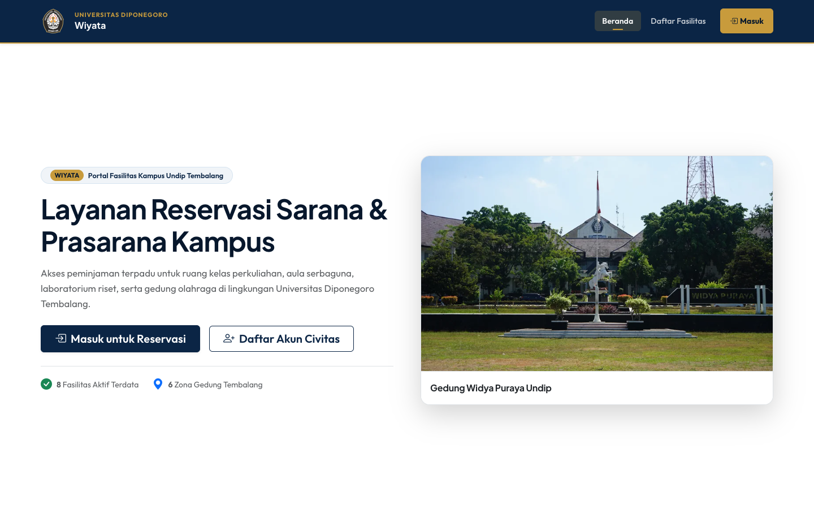  
*Gambar 1. Tampilan Beranda Publik Wiyata (Desktop)*

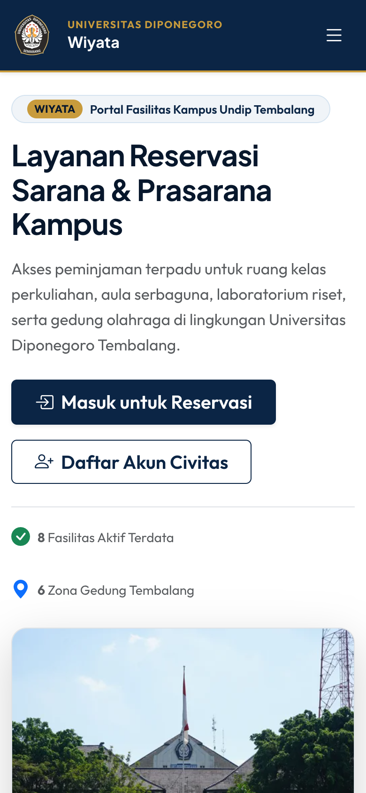  
*Gambar 2. Tampilan Beranda Publik Wiyata (Mobile)*

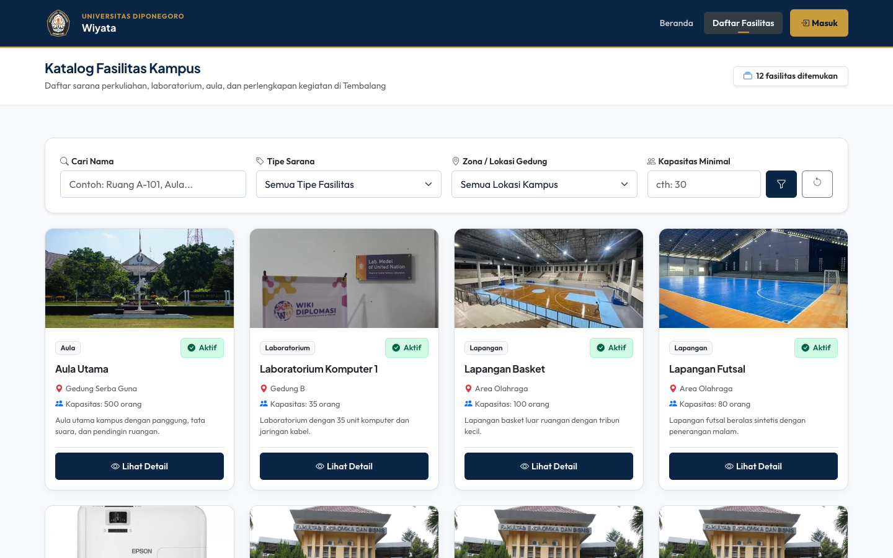  
*Gambar 3. Katalog Pencarian dan Filter Fasilitas Kampus (Desktop)*

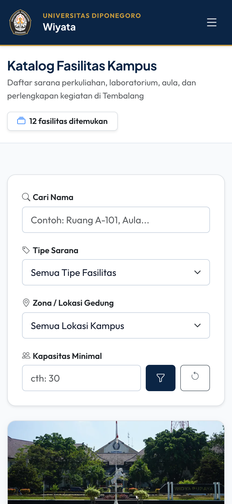  
*Gambar 4. Katalog Pencarian Fasilitas Kampus (Mobile)*

---

### 5.2 Fitur (2): Autentikasi Pengguna & Registrasi Mandiri Civitas
- **Tujuan Fitur:** Mengamankan akses sistem dan memfasilitasi pendaftaran akun mandiri bagi civitas akademika Universitas Diponegoro.
- **Aktor Terkait:** Civitas Akademika Baru dan Pengguna Terdaftar.
- **Alur Penggunaan:** Pengguna memilih tombol 'Daftar Akun Civitas' (`/register`), mengisi nama lengkap, email institusi, kata sandi, nomor identitas (NIM/NIP), serta tipe civitas (Mahasiswa, Dosen, atau Staf). Setelah registrasi berhasil, akun berstatus 'pending' menunggu verifikasi admin. Pengguna yang telah diverifikasi dapat masuk melalui halaman login (`/login`) menggunakan email dan password.
- **Aturan Bisnis & Validasi:** Aturan C1-C6: Hanya akun berstatus 'verified' yang diizinkan mengakses menu reservasi dan pelaporan. Nomor identitas (NIM/NIP) wajib berupa kombinasi numerik unik dan hanya berlaku untuk peran 'pengguna'. Pengguna dengan status pending, rejected, atau suspended ditolak masuk dengan notifikasi status yang jelas.

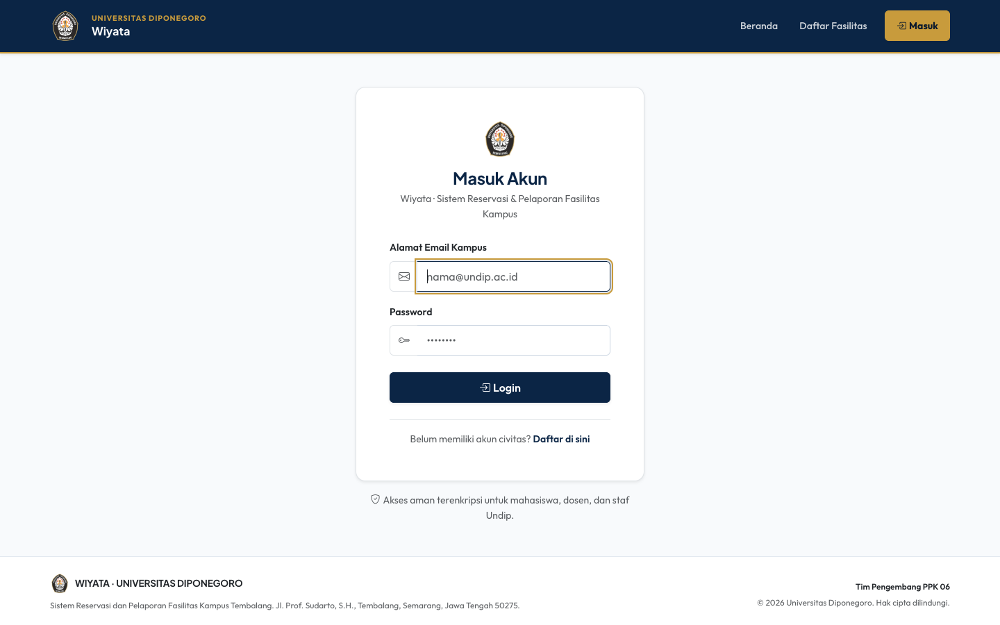  
*Gambar 5. Formulir Masuk Akun Pengguna (Desktop)*

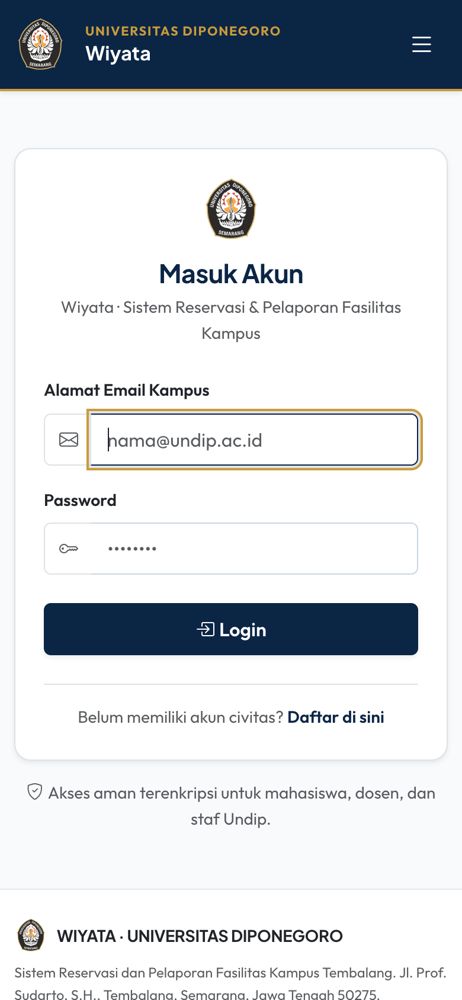  
*Gambar 6. Formulir Masuk Akun Pengguna (Mobile)*

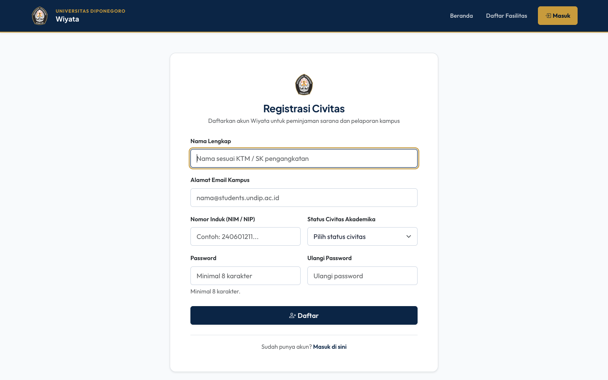  
*Gambar 7. Formulir Registrasi Mandiri Civitas Akademika (Desktop)*

---

### 5.3 Fitur (3): Detail Fasilitas & Grid Ketersediaan Waktu (Slot Availability)
- **Tujuan Fitur:** Menampilkan spesifikasi lengkap ruangan/alat serta visualisasi jadwal ketersediaan waktu secara interaktif per hari.
- **Aktor Terkait:** Pengguna Terverifikasi dan Tamu Publik.
- **Alur Penggunaan:** Pengguna memilih salah satu kartu fasilitas dari katalog (`/facilities/{id}`). Halaman menampilkan galeri foto, kapasitas ruangan, zona lokasi, deskripsi fasilitas, serta kalender grid ketersediaan 26 slot waktu (07.00 - 20.00 WIB) dengan interval 30 menit. Pengguna dapat mengganti tanggal peninjauan untuk melihat status penggunaan.
- **Aturan Bisnis & Validasi:** Aturan D5 & F4: Slot waktu memiliki tiga representasi visual: Biru Outline (Tersedia), Abu-abu Terisi (Terpesan oleh reservasi berstatus approved), dan Biru Solid (Terpilih oleh pengguna). Untuk menjaga privasi pengguna (F4), publik hanya dapat melihat status terpesan tanpa menampilkan nama pemohon atau tujuan kegiatan.

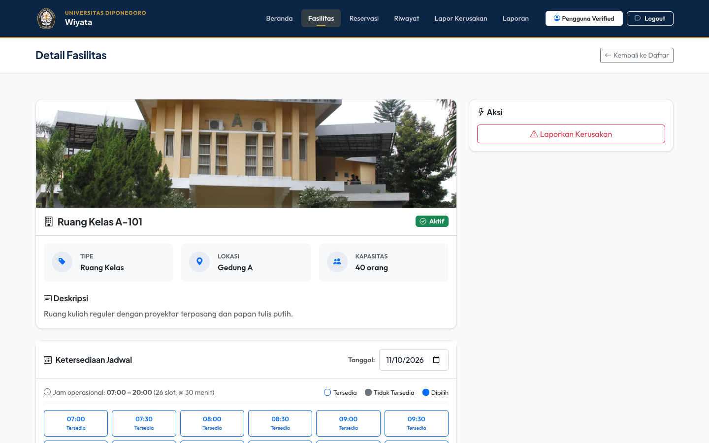  
*Gambar 8. Detail Fasilitas dan Grid Ketersediaan 26 Slot Waktu (Desktop)*

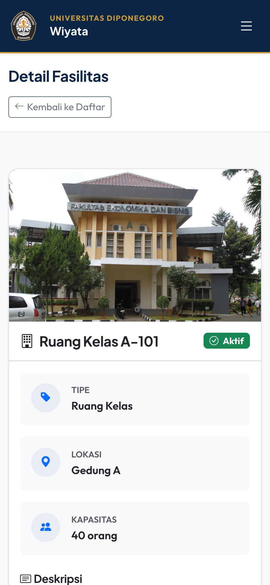  
*Gambar 9. Detail Fasilitas dan Grid Ketersediaan Waktu (Mobile)*

---

### 5.4 Fitur (4): Pengajuan Reservasi Sarana Prasarana Kampus
- **Tujuan Fitur:** Memfasilitasi pengajuan peminjaman fasilitas secara terstruktur dengan validasi pencegahan bentrok jadwal otomatis.
- **Aktor Terkait:** Pengguna Terverifikasi (Civitas Akademika).
- **Alur Penggunaan:** Pengguna memilih rentang slot waktu yang tersedia langsung pada grid halaman detail atau melalui formulir reservasi (`/reservations/create?facility_id={id}`). Pengguna mengisi tanggal peminjaman, jam mulai, jam selesai, serta tujuan peminjaman. Sistem memvalidasi ketersediaan dan memasukkan permohonan ke antrian 'pending'.
- **Aturan Bisnis & Validasi:** Aturan F1 & F2: Jam mulai dan jam selesai harus berada pada rentang operasional 07.00 - 20.00 WIB, dengan durasi minimal 30 menit. Sistem menolak pengajuan apabila rentang waktu yang dipilih beririsan dengan reservasi berstatus approved lain pada fasilitas yang sama.

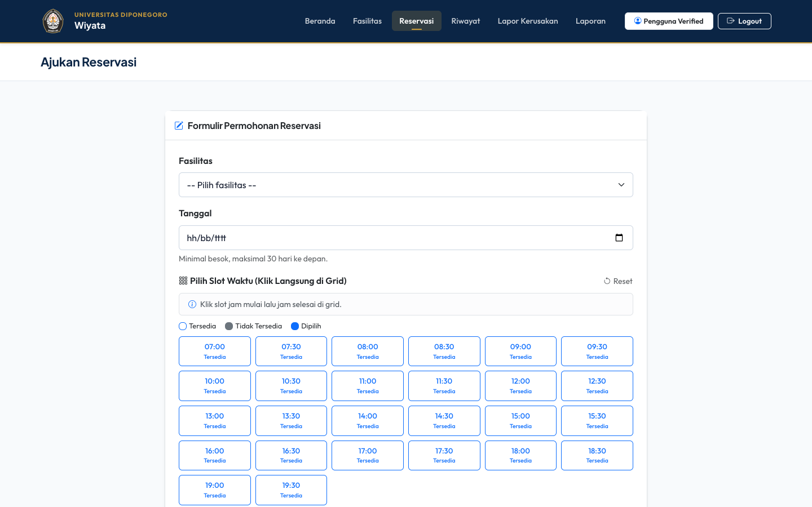  
*Gambar 10. Formulir Pengajuan Reservasi Fasilitas (Desktop)*

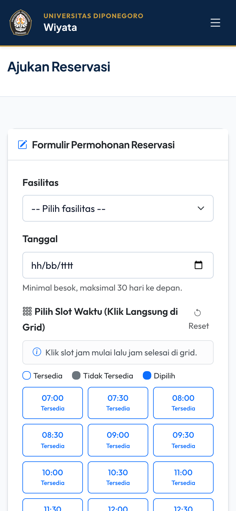  
*Gambar 11. Formulir Pengajuan Reservasi Fasilitas (Mobile)*

---

### 5.5 Fitur (5): Riwayat & Detail Tiket Reservasi Pengguna
- **Tujuan Fitur:** Memungkinkan civitas akademika memantau status persetujuan peminjaman serta membatalkan permohonan mandiri.
- **Aktor Terkait:** Pengguna Terverifikasi (Civitas Akademika).
- **Alur Penggunaan:** Pengguna membuka menu 'Riwayat' (`/reservations`) untuk melihat daftar reservasi yang diajukan beserta status terkininya (Pending, Approved, Rejected, Cancelled). Pengguna dapat menekan tombol detail (`/reservations/{id}`) untuk melihat rangkuman tiket. Pengguna dapat membatalkan reservasi yang masih berstatus pending.
- **Aturan Bisnis & Validasi:** Pengguna hanya diizinkan melihat dan membatalkan reservasi miliknya sendiri (diamankan via Laravel Policy `ReservationPolicy::view`). Tombol pembatalan dinonaktifkan secara otomatis jika reservasi sudah berstatus approved, rejected, atau jika waktu mulai peminjaman telah kedaluwarsa (A8).

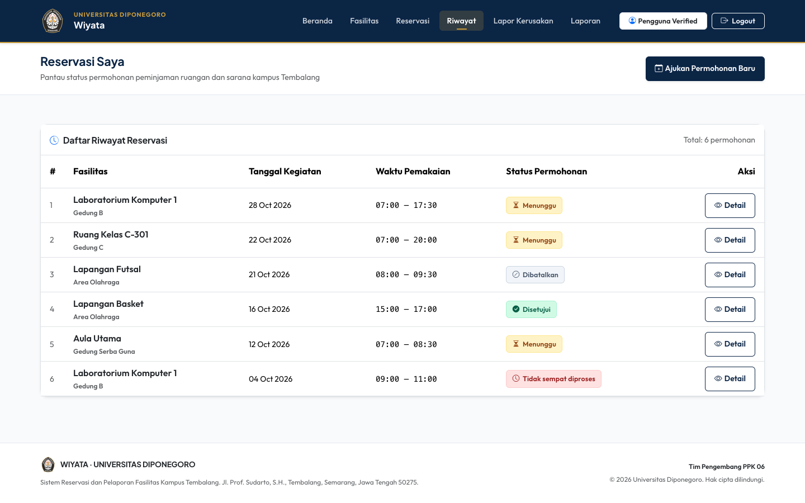  
*Gambar 12. Daftar Riwayat Permohonan Reservasi Pengguna (Desktop)*

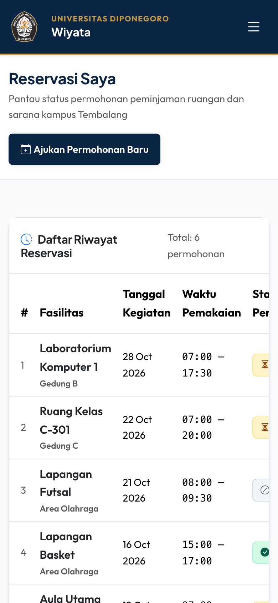  
*Gambar 13. Daftar Riwayat Reservasi Pengguna (Mobile)*

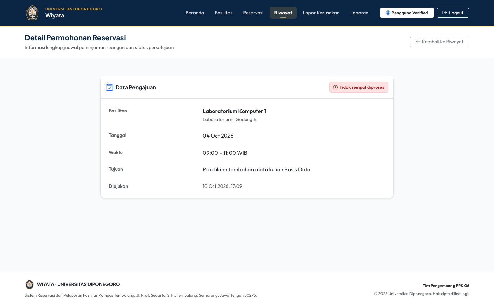  
*Gambar 14. Detail Tiket Informasi Reservasi Pengguna (Desktop)*

---

### 5.6 Fitur (6): Pelaporan Kerusakan Sarana Prasarana Kampus
- **Tujuan Fitur:** Menyediakan sarana aduan cepat bagi civitas akademika jika menemui kerusakan atau malfungsi fasilitas di area kampus.
- **Aktor Terkait:** Pengguna Terverifikasi (Civitas Akademika).
- **Alur Penggunaan:** Pengguna mengakses menu 'Lapor Kerusakan' (`/reports/create`), memilih fasilitas yang bermasalah, menulis deskripsi kendala fisik, dan mengunggah 1 hingga 3 foto bukti kerusakan. Laporan yang terkirim dapat dipantau perkembangannya pada menu daftar laporan (`/reports`).
- **Aturan Bisnis & Validasi:** Aturan B1-B5 & F5: Setiap laporan wajib menyertakan minimal 1 foto dan maksimal 3 foto dengan format JPG/JPEG/PNG serta ukuran maksimal 3MB per berkas. Nama berkas diacak secara otomatis menggunakan `Str::random(40)` untuk keamanan penyimpanan.

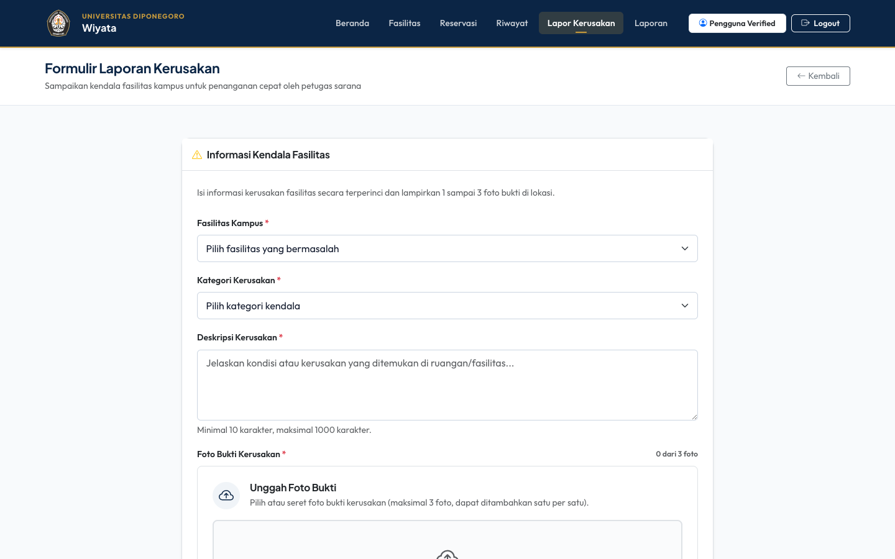  
*Gambar 15. Formulir Pelaporan Kerusakan Fasilitas dengan Unggah Foto (Desktop)*

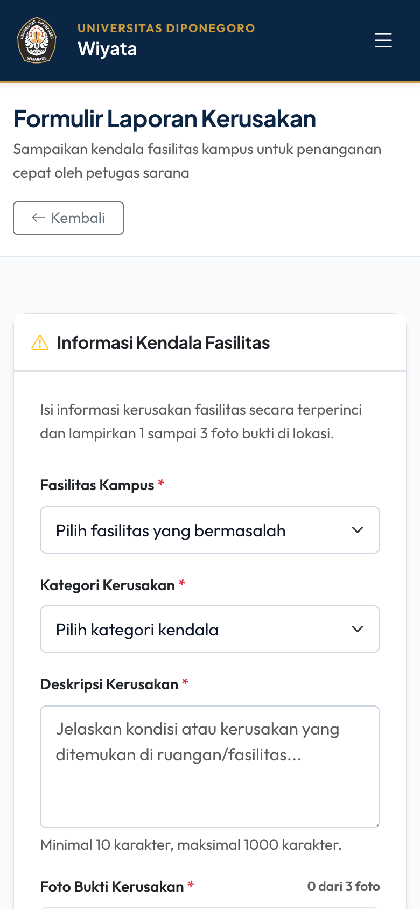  
*Gambar 16. Formulir Pelaporan Kerusakan Fasilitas (Mobile)*

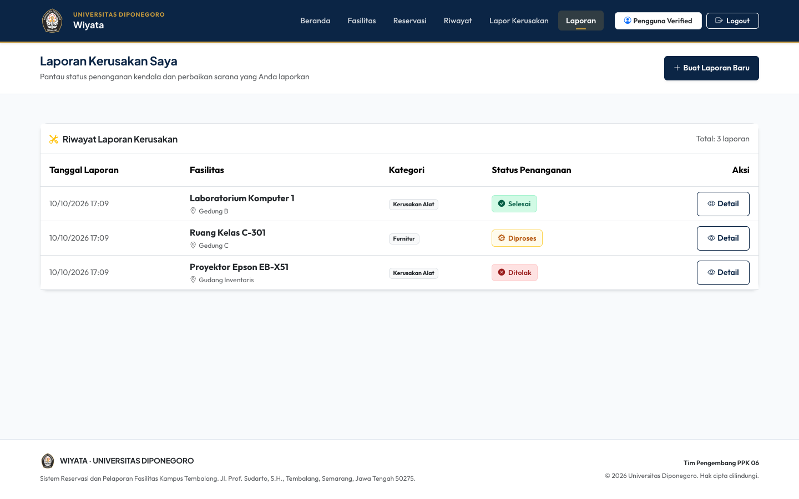  
*Gambar 17. Daftar Riwayat Pelaporan Kerusakan oleh Pengguna (Desktop)*

---

### 5.7 Fitur (7): Dashboard & Verifikasi Antrian Reservasi (Petugas)
- **Tujuan Fitur:** Memberikan ikhtisar operasional harian bagi petugas fasilitas serta alur verifikasi persetujuan peminjaman sarana.
- **Aktor Terkait:** Petugas Fasilitas dan Laboratorium.
- **Alur Penggunaan:** Petugas masuk ke sistem dan diarahkan ke Dashboard (`/officer`). Petugas melihat daftar reservasi yang menunggu verifikasi dan daftar laporan kendala yang belum tuntas. Petugas memilih menu 'Antrian' (`/officer/reservations`), membuka detail permohonan (`/officer/reservations/{id}`), lalu mengeksekusi aksi Persetujuan (Approve) atau Penolakan (Reject) disertai alasan.
- **Aturan Bisnis & Validasi:** Aturan F2: Eksekusi persetujuan reservasi dibungkus dalam `DB::transaction()` dengan `lockForUpdate()` pada tabel `reservations` untuk menjamin konsistensi data dan mencegah bentrok ganda jika terdapat permohonan bersamaan pada rentang slot yang sama.

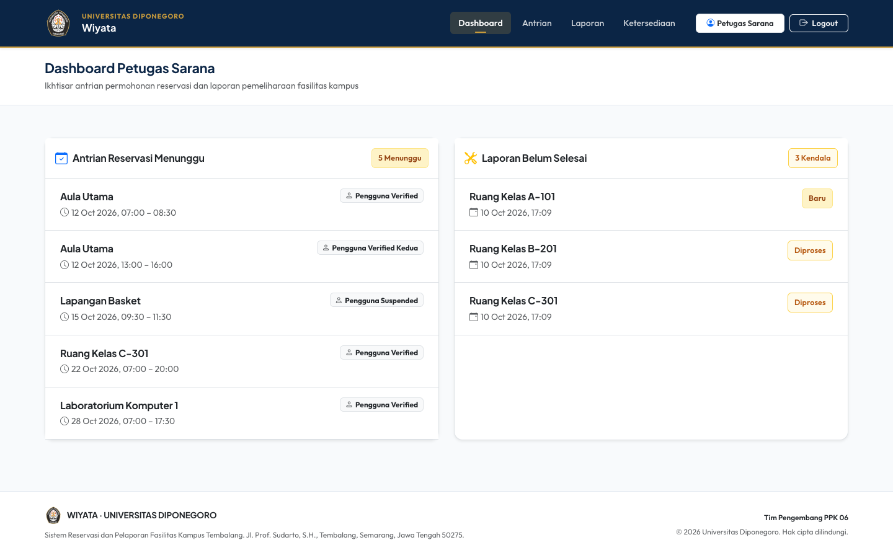  
*Gambar 18. Dashboard Operasional Antrian Petugas (Desktop)*

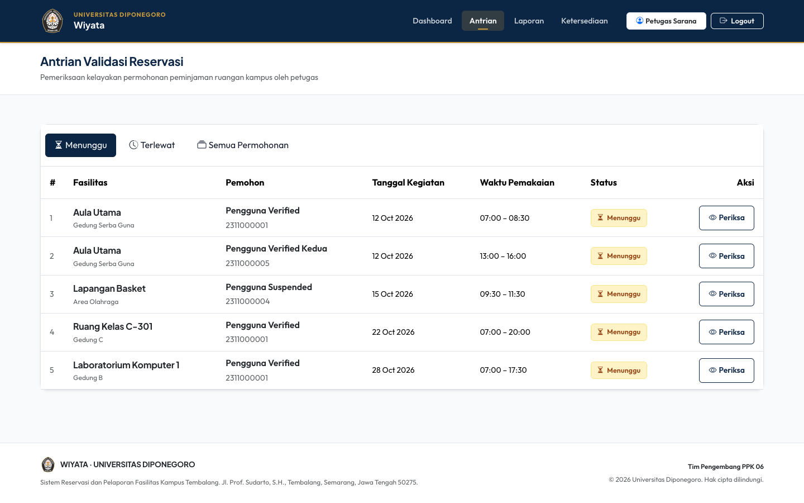  
*Gambar 19. Antrian Permohonan Reservasi Masuk bagi Petugas (Desktop)*

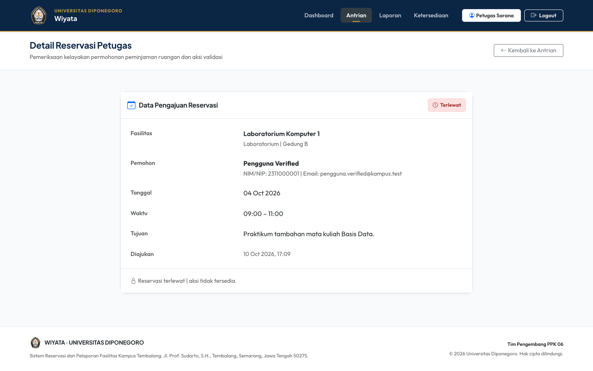  
*Gambar 20. Detail Peninjauan dan Aksi Verifikasi Reservasi Petugas (Desktop)*

---

### 5.8 Fitur (8): Tindak Lanjut Laporan Kerusakan & Kontrol Fasilitas (Petugas)
- **Tujuan Fitur:** Memungkinkan petugas menindaklanjuti keluhan sarana, mengisikan catatan perbaikan, serta mengubah status fasilitas rusak.
- **Aktor Terkait:** Petugas Fasilitas dan Laboratorium.
- **Alur Penggunaan:** Petugas membuka menu 'Laporan' (`/officer/reports`), memilih aduan kerusakan (`/officer/reports/{id}`), memeriksa foto bukti fisik di panel lightbox, memperbarui status penanganan (Baru, Diproses, Selesai, Ditolak), dan mengisi catatan perbaikan. Jika kerusakan parah, petugas dapat langsung mengubah status fasilitas menjadi 'under_maintenance'.
- **Aturan Bisnis & Validasi:** Aturan B3 & D4: Catatan resolusi (`resolution_note`) wajib diisi minimal 10 karakter jika status laporan diubah menjadi 'Selesai' atau 'Ditolak'. Jika fasilitas ditandai dalam perbaikan dan terdapat reservasi approved di masa mendatang, sistem memunculkan modal peringatan D4.

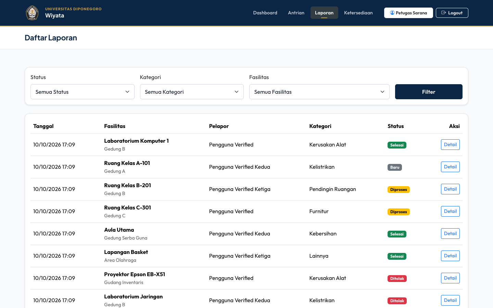  
*Gambar 21. Daftar Keluhan Kerusakan Sarana bagi Petugas (Desktop)*

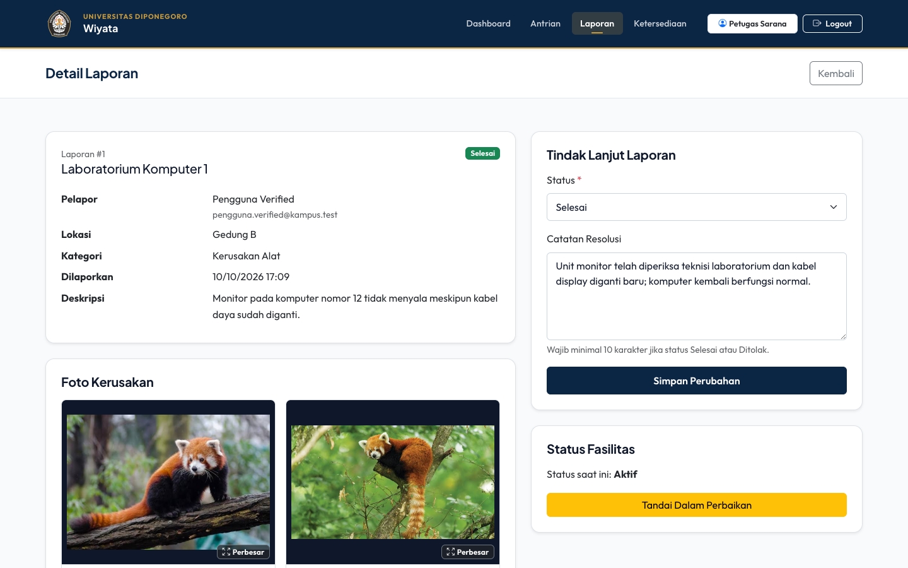  
*Gambar 22. Detail Tindak Lanjut Laporan Kerusakan dan Catatan Resolusi (Desktop)*

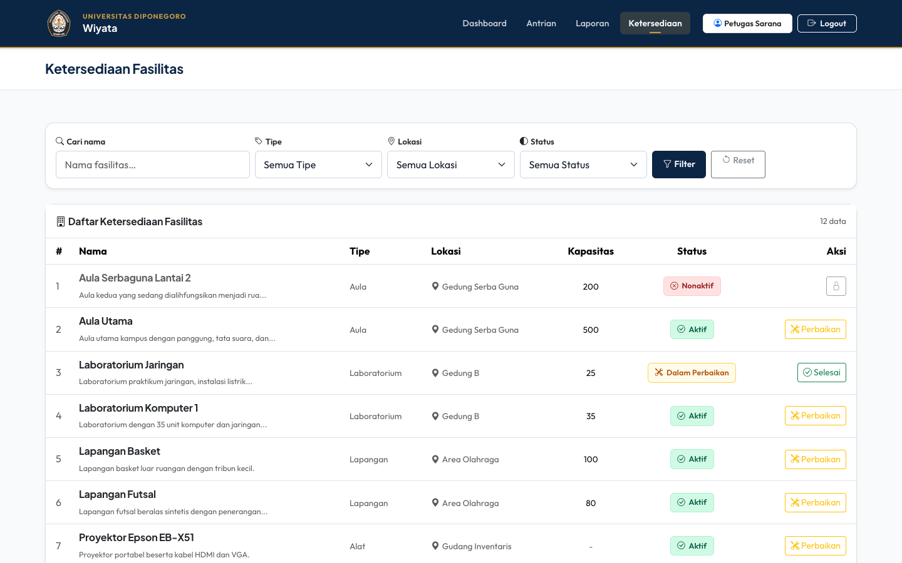  
*Gambar 23. Pengelolaan Ketersediaan dan Status Pemeliharaan Fasilitas oleh Petugas (Desktop)*

---

### 5.9 Fitur (9): Manajemen Master Data Fasilitas Kampus (Admin)
- **Tujuan Fitur:** Memberikan hak kontrol penuh bagi administrator institusi untuk menambah, memperbarui, dan menonaktifkan sarana kampus.
- **Aktor Terkait:** Administrator Kampus.
- **Alur Penggunaan:** Admin membuka menu 'Fasilitas' (`/admin/facilities`), melihat tabel seluruh fasilitas kampus beserta statusnya, menambah fasilitas baru melalui tombol tambah (`/admin/facilities/create`), atau mengubah data kapasitas, lokasi gedung, serta tipe fasilitas melalui tombol edit.
- **Aturan Bisnis & Validasi:** Aturan D1-D3: Admin memiliki wewenang mengalihkan status fasilitas antara 'active' dan 'inactive'. Tipe fasilitas terstandarisasi (Aula, Laboratorium, Ruang Kelas, Lapangan, Alat). Untuk tipe 'Alat', kapasitas wajib bernilai null.

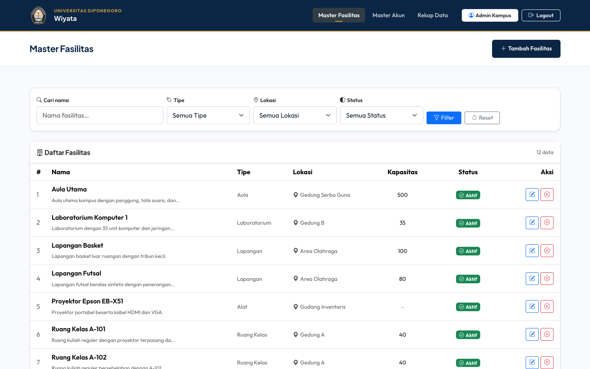  
*Gambar 24. Daftar Master Sarana Prasarana Kampus di Panel Admin (Desktop)*

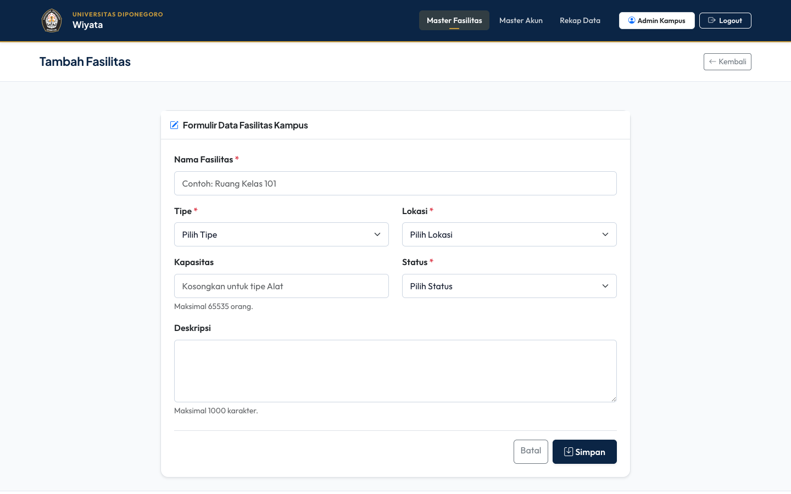  
*Gambar 25. Formulir Tambah dan Edit Master Fasilitas Kampus (Desktop)*

---

### 5.10 Fitur (10): Manajemen Pengguna & Siklus Hidup Akun Civitas (Admin)
- **Tujuan Fitur:** Mengelola data seluruh pengguna, memverifikasi registrasi civitas baru, serta mengendalikan hak akses akun.
- **Aktor Terkait:** Administrator Kampus.
- **Alur Penggunaan:** Admin mengakses menu 'Pengguna' (`/admin/users`) yang menampilkan daftar akun dengan prioritas teratas pada akun berstatus 'pending'. Admin memilih akun pengguna (`/admin/users/{id}`) untuk memverifikasi keabsahan identitas (Verifikasi), menolak pendaftaran (Tolak), menonaktifkan akun yang melanggar aturan (Suspend), mengaktifkan kembali (Aktifkan), atau mereset password.
- **Aturan Bisnis & Validasi:** Aturan C2-C6: Penonaktifan akun (suspend) hanya dapat dilakukan pada akun berstatus verified dan memicu modal peringatan D4 jika akun tersebut memiliki reservasi approved mendatang. Admin dilarang menonaktifkan akun miliknya sendiri.

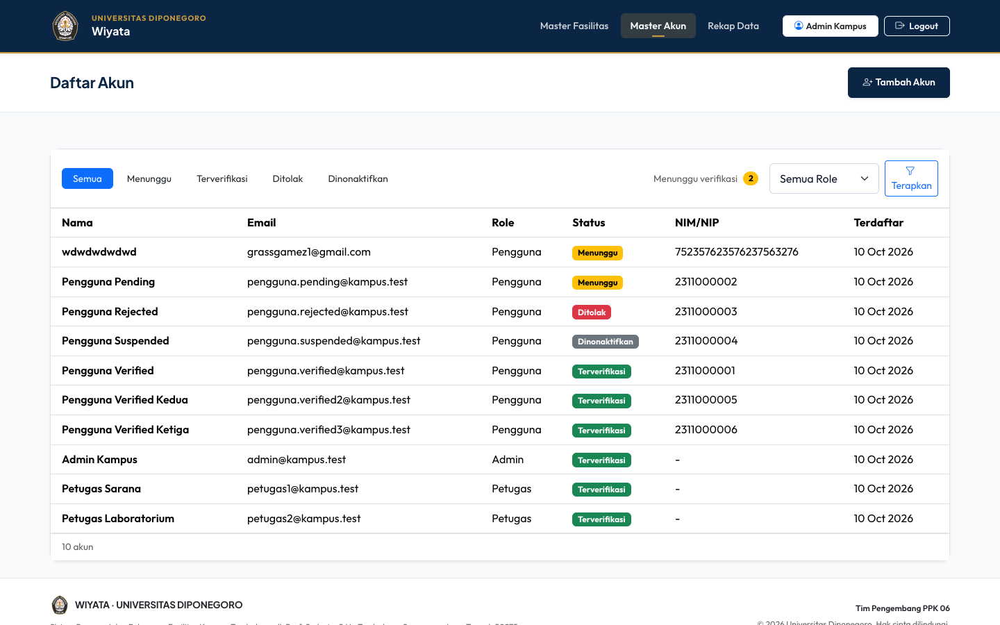  
*Gambar 26. Daftar Manajemen Akun Civitas dan Filter Status di Panel Admin (Desktop)*

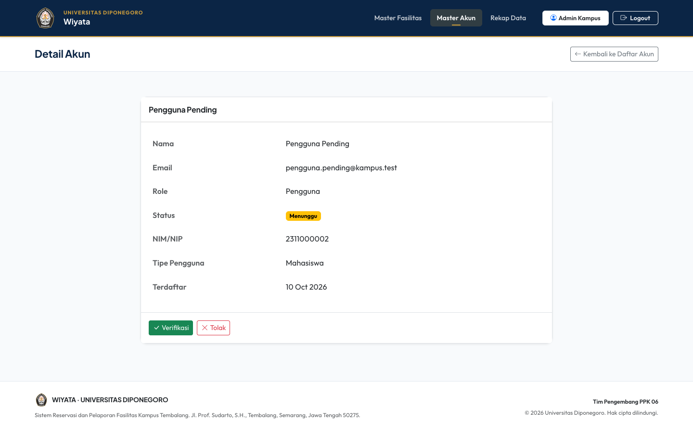  
*Gambar 27. Detail Verifikasi Pengguna dan Kontrol Siklus Hidup Akun (Desktop)*

---

### 5.11 Fitur (11): Rekapitulasi Statistik Operasional & Ekspor Laporan (Admin)
- **Tujuan Fitur:** Menyajikan analitik data reservasi sarana dan keluhan fasilitas serta fasilitas ekspor data laporan institusional.
- **Aktor Terkait:** Administrator Kampus.
- **Alur Penggunaan:** Admin membuka menu 'Rekap' (`/admin/recap`), menentukan rentang tanggal peninjauan, dan menekan tombol filter. Halaman menampilkan ringkasan metrik total reservasi, rasio persetujuan, frekuensi penggunaan ruangan, serta rekapitulasi penanganan kerusakan. Admin dapat menekan tombol 'Ekspor CSV' (`/admin/recap/export`) untuk mengunduh berkas laporan tabular.
- **Aturan Bisnis & Validasi:** Aturan E1-E5: Parameter query string pada tombol ekspor dibuat identik dengan parameter filter halaman indeks untuk menjamin bahwa data yang diunduh mencerminkan rentang waktu dan kriteria penyaringan yang sedang ditampilkan pada layar.

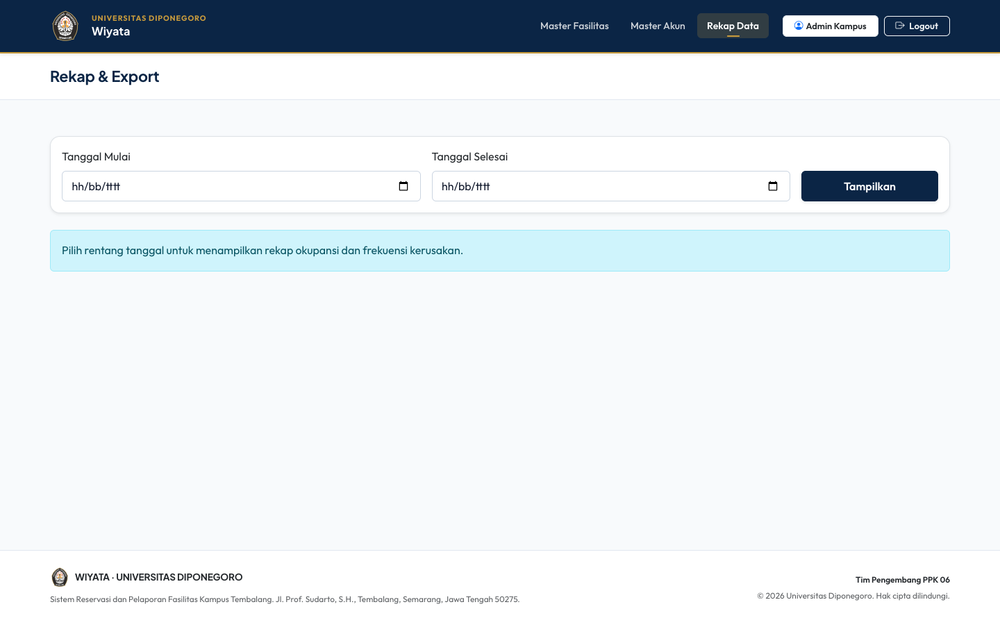  
*Gambar 28. Panel Rekapitulasi Analitik dan Statistik Penggunaan Fasilitas (Desktop)*

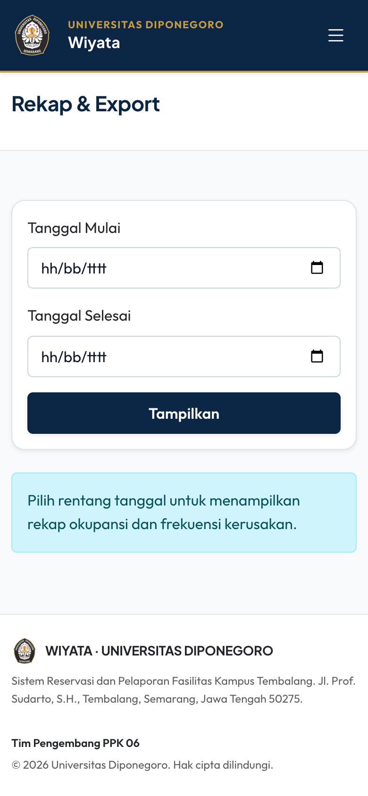  
*Gambar 29. Panel Rekapitulasi Statistik Operasional (Mobile)*

---

## 6. Arsitektur dan Basis Data

Aplikasi Wiyata menerapkan pola arsitektur Model-View-Controller (MVC) standar Laravel 13. Lapisan basis data dikelola melalui skema migrasi terstruktur pada direktori `database/migrations` yang terdiri atas lima entitas tabel relasional utama:

1. **Tabel `users`**  
   Menyimpan data identitas akun pengguna, petugas, dan admin.  
   *Kolom Utama:* `id`, `name`, `email`, `password`, `role` (admin, petugas, pengguna), `status` (verified, pending, rejected, suspended), `identity_number` (NIM/NIP), `user_type` (mahasiswa, dosen, staf), `remember_token`, `created_at`, `updated_at`.
2. **Tabel `facilities`**  
   Menyimpan data master sarana dan prasarana kampus Undip Tembalang.  
   *Kolom Utama:* `id`, `name`, `type` (Aula, Laboratorium, Ruang Kelas, Lapangan, Alat), `location` (Gedung A, B, C, D, E, Kompleks Olahraga), `capacity`, `status` (active, inactive, under_maintenance), `description`, `created_at`, `updated_at`.
3. **Tabel `reservations`**  
   Menyimpan catatan pengajuan peminjaman fasilitas oleh civitas akademika.  
   *Kolom Utama:* `id`, `user_id` (FK users), `facility_id` (FK facilities), `start_time`, `end_time`, `purpose`, `status` (pending, approved, rejected, cancelled_by_user, cancelled_by_officer), `status_reason`, `created_at`, `updated_at`.
4. **Tabel `reports`**  
   Menyimpan tiket aduan keluhan dan kerusakan sarana prasarana.  
   *Kolom Utama:* `id`, `user_id` (FK users), `facility_id` (FK facilities), `category` (kerusakan_alat, kelistrikan, pendingin_ruangan, furnitur, kebersihan, lainnya), `description`, `status` (baru, diproses, selesai, ditolak), `resolution_note`, `created_at`, `updated_at`.
5. **Tabel `report_photos`**  
   Menyimpan berkas foto bukti fisik yang diunggah pada laporan kerusakan.  
   *Kolom Utama:* `id`, `report_id` (FK reports, onDelete cascade), `file_name`, `created_at`, `updated_at`.

### Relasi Kunci Antar-Tabel (Foreign Key Integrity):
- **Relasi Pengguna dengan Reservasi:** Satu pengguna dapat memiliki banyak reservasi (`User` hasMany `Reservation`; `Reservation` belongsTo `User`).
- **Relasi Fasilitas dengan Reservasi:** Satu fasilitas dapat dipinjam dalam banyak rentang jadwal reservasi (`Facility` hasMany `Reservation`; `Reservation` belongsTo `Facility`).
- **Relasi Pengguna dengan Laporan:** Satu civitas dapat melaporkan banyak kendala fasilitas (`User` hasMany `Report`; `Report` belongsTo `User`).
- **Relasi Fasilitas dengan Laporan:** Satu fasilitas dapat memiliki banyak riwayat laporan kerusakan (`Facility` hasMany `Report`; `Report` belongsTo `Facility`).
- **Relasi Laporan dengan Foto Bukti:** Satu tiket laporan kerusakan dapat memiliki 1 hingga 3 berkas foto bukti fisik (`Report` hasMany `ReportPhoto`; `ReportPhoto` belongsTo `Report`) dengan aturan penghapusan berantai (*cascade delete*).

---

## 7. Hak Akses per Role (Matriks Otorisasi)

Sistem menerapkan kontrol akses berbasis peran (*Role-Based Access Control*) melalui middleware role di Laravel. Matriks berikut memetakan wewenang dan batasan setiap aktor terhadap 11 fitur aplikasi:

| Modul / Fitur Aplikasi | Publik / Tamu | Pengguna (Civitas) | Petugas Fasilitas | Administrator |
| :--- | :---: | :---: | :---: | :---: |
| Fitur 1: Beranda & Katalog Publik | Akses Penuh | Akses Penuh | Akses Penuh | Akses Penuh |
| Fitur 2: Registrasi & Login | Akses Penuh | Login Saja | Login Saja | Login Saja |
| Fitur 3: Detail Fasilitas & Grid Slot | Akses Baca | Pilih Slot | Akses Penuh | Akses Penuh |
| Fitur 4: Pengajuan Reservasi | Tidak Diizinkan | Akses Penuh | Tidak Diizinkan | Tidak Diizinkan |
| Fitur 5: Riwayat Reservasi Saya | Tidak Diizinkan | Reservasi Sendiri | Tidak Diizinkan | Tidak Diizinkan |
| Fitur 6: Pelaporan Kerusakan | Tidak Diizinkan | Akses Penuh | Tidak Diizinkan | Tidak Diizinkan |
| Fitur 7: Dashboard & Antrian Reservasi | Tidak Diizinkan | Tidak Diizinkan | Approve/Reject | Lihat Saja |
| Fitur 8: Tindak Lanjut Laporan Kerusakan | Tidak Diizinkan | Tidak Diizinkan | Update & Resolusi | Lihat Saja |
| Fitur 9: Kelola Master Fasilitas | Tidak Diizinkan | Tidak Diizinkan | Status Perbaikan | CRUD & Active/Inactive |
| Fitur 10: Manajemen Akun Civitas | Tidak Diizinkan | Tidak Diizinkan | Tidak Diizinkan | Verifikasi, Suspend, Reset |
| Fitur 11: Rekapitulasi & Ekspor CSV | Tidak Diizinkan | Tidak Diizinkan | Tidak Diizinkan | Filter & Ekspor Penuh |

---

## 8. Pengujian Sistem (Automated & Manual Testing)

Kualitas dan keandalan sistem Wiyata diverifikasi melalui dua metode pengujian: Automated Feature Testing menggunakan Pest Framework dan Pengujian Manual Skenario Pengguna (User Acceptance Testing).

### A. Pengujian Terotomatisasi (Pest Framework)
Test suite sistem terdiri atas 214 test case terintegrasi dengan 961 asersi pengujian. Pengujian mencakup cakupan fitur otentikasi login, registrasi, otorisasi peran, validasi formulir reservasi, deteksi bentrok jadwal F2, pengunggahan foto laporan B1-B5, serta ekspor rekapitulasi data. Berdasarkan eksekusi nyata pada lingkungan MySQL (`DB_CONNECTION=mysql DB_DATABASE=reservasi_fasilitas vendor/bin/pest`), sebanyak 213 test case berhasil lolos sempurna (99.5% passing rate). Satu pengujian pengurutan akun pending memiliki variasi sekunder pada urutan created_at karena waktu pembuatan seeder yang identik pada detik yang sama.

### B. Pengujian Manual Skenario Utama

| ID Skenario | Deskripsi Uji | Hasil yang Diharapkan | Status |
| :---: | :--- | :--- | :---: |
| UJI-01 | Pencegahan Akun Pending Login | Sistem menolak login akun pending dan menampilkan pesan status | BERHASIL (PASS) |
| UJI-02 | Pencegahan Bentrok Jadwal Peminjaman | Sistem mendeteksi irisan slot waktu terisi dan menggagalkan reservasi bentrok | BERHASIL (PASS) |
| UJI-03 | Validasi Multi-Upload Foto Laporan | Sistem menerima 1-3 foto valid (JPG/PNG maks 3MB) dan menolak berkas non-gambar | BERHASIL (PASS) |
| UJI-04 | Modal Peringatan D4 Saat Fasilitas Masuk Perbaikan | Sistem menampilkan daftar reservasi approved mendatang yang berpotensi terdampak | BERHASIL (PASS) |
| UJI-05 | Pemisahan Hak Akses Petugas vs Admin | Petugas tidak dapat membuka URL /admin/* dan diarahkan dengan error 403 Forbidden | BERHASIL (PASS) |
| UJI-06 | Ekspor Laporan CSV dengan Filter Tanggal | Berkas CSV terunduh berisi data transaksi yang sinkron dengan rentang tanggal terpilih | BERHASIL (PASS) |

---

## 9. Kendala dan Kesimpulan

### A. Kendala Teknis & Solusi
- **Penanganan Concurrency dan Race Condition Slot:** Pada jam sibuk, terdapat potensi dua civitas akademika mengajukan slot waktu yang sama secara hampir bersamaan. Kendala ini diselesaikan pada modul M3 dengan membungkus proses verifikasi dan persetujuan dalam transaksi basis data serta menerapkan klausa `lockForUpdate()` pada tabel reservations, sehingga integritas data terjamin bebas bentrok.
- **Kompleksitas Grid 26 Slot Waktu pada Layar Mobile:** Tampilan grid 26 slot waktu (07.00 - 20.00 WIB) memerlukan kerapatan tata letak yang tinggi. Kendala ini diatasi dengan merancang wadah berpenyaring tanggal yang responsif, mengelompokkan tombol waktu dalam grid 2 kolom pada layar sempit, serta mengaktifkan fungsi pemilihan rentang waktu otomatis.
- **Pengelolaan Berkas Foto Kerusakan Fasilitas:** Pengunggahan multi-foto rentan terhadap batas ukuran upload web server. Tim menambahkan validasi ketat di sisi client dan server (`mimes:jpg,jpeg,png` dan `max:3072`) serta mengimplementasikan penamaan acak menggunakan `Str::random(40)` untuk mencegah penumpukan nama berkas yang sama.

### B. Kesimpulan
Pengembangan aplikasi "Wiyata" berhasil menyelesaikan permasalahan peminjaman fasilitas kampus Undip Tembalang yang sebelumnya dilakukan secara manual. Melalui pembagian kerja terstruktur antar empat anggota tim, Wiyata kini menyediakan portal reservasi terpadu dengan transparansi ketersediaan slot waktu, sistem pelaporan kendala sarana prasarana yang akuntabel, serta dasbor analitik yang membantu pengambilan keputusan manajemen kampus. Seluruh fitur telah teruji secara komprehensif dan siap dioperasikan di lingkungan institusi pendidikan.
